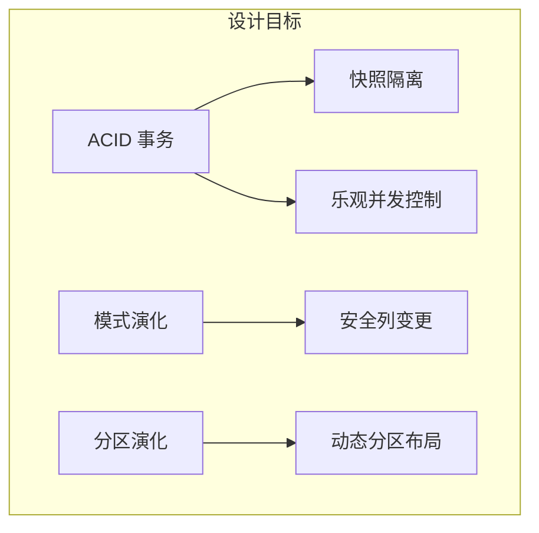
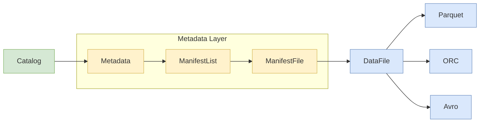
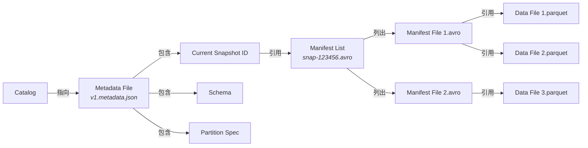
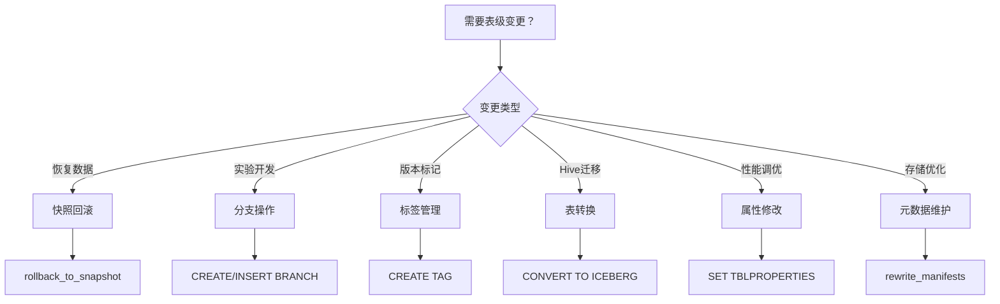
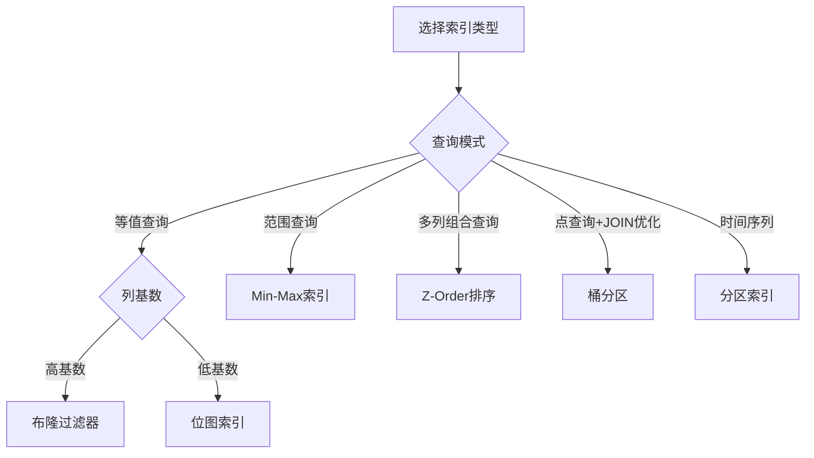
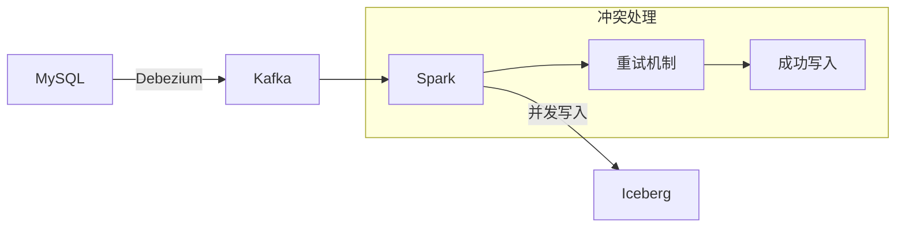
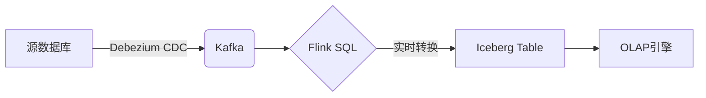

## Part I: Apache Iceberg Fundamentals

#### Introducing Apache Iceberg

###### 数据湖的演进与挑战

- **传统数据湖（Hive 表格式）的缺陷：**
  - **分区锁定**：查询必须显式指定分区字段（如 `WHERE dt='2025-07-06'`）。
  - **无原子性**：并发写入导致数据覆盖或部分可见。
  - **低效元数据**：`LIST` 操作扫描全部分区目录（云存储成本高）。
- **Iceberg 的革新目标：**解耦计算引擎与存储格式（支持 Spark/Flink/Trino 等）；提供 ACID 事务、模式演化和分区演化能力。 

###### Iceberg 核心设计目标

- **ACID 事务**
  - **基于快照的隔离**：写入生成新快照，查询读取历史一致性视图。
  - **乐观锁并发控制（OCC**）：冲突时自动重试或报错。
- **模式演化（Schema Evolution）**：安全地新增/重命名/删除列（无需重写数据文件）；向后兼容：旧查询可读新数据。
- **分区演化（Partition Evolution）**：动态修改分区策略（如从 `月` 改为 `天`），旧查询无需改写。
- **隐藏分区（Hidden Partitioning）**
  - 表定义分区变换（如 `hours(timestamp)`）。
  - 写入时自动计算分区值并记录在元数据中。
  - 查询时引擎根据 `WHERE` 条件过滤分区（用户无需知道分区字段名）。



###### Iceberg 架构分层

- **Catalog 层**：存储表的位置和元数据指针（支持 Hive/Nessie/JDBC）。
- **元数据层**：
  - **元数据文件（Metadata JSON）**：记录当前快照指针、模式、分区信息。
  - **清单列表（Manifest List）**：快照包含的所有清单文件及其统计信息。
  - **清单文件（Manifest File）**：列出数据文件路径、分区范围、行数等统计信息。
- **数据层**：实际存储文件（Parquet/ORC/Avro），按分区组织。



###### Iceberg vs. 其他表格格式

| **特性**         | **Apache Iceberg** | **Delta Lake** | **Apache Hudi**      |
| :--------------- | :----------------- | :------------- | :------------------- |
| **ACID 支持**    | ✅ 快照隔离         | ✅ 事务日志     | ✅ 时间轴管理         |
| **分区演化**     | ✅ 无需重写数据     | ❌ 需重写数据   | ⚠️ 部分支持           |
| **计算引擎耦合** | ❌ 解耦（通用API）  | ⚠️ 强依赖 Spark | ⚠️ 强依赖 Spark/Flink |
| **云存储优化**   | ✅ 避免 LIST 操作   | ⚠️ 依赖元存储   | ⚠️ 依赖元存储         |

#### Iceberg表结构规范

###### 元数据层级结构

- **Catalog**：表入口点（如 Hive/Nessie），存储最新元数据文件位置
- **Metadata File (JSON)**：当前快照ID；表模式（Schema）；分区规范（Partition Spec）；历史快照列表。
- **Manifest List (Avro)**：快照包含的所有清单文件路径；每个清单文件的分区范围统计。
- **Manifest File (Avro)**：数据文件路径列表；文件格式（Parquet/ORC/AVRO）；列级统计（min/max/null计数）；文件所属分区。
- **Data File**：实际数据文件（列式存储）



###### 快照（Snapshot）机制

- **快照**：数据表在特定时间点的完整状态。
- **关键属性**
  - **snapshot-id**：唯一标识符
  - **timestamp-ms**：创建时间戳
  - **manifest-list**：关联的清单列表位置
- **快照生成**：每次写操作（INSERT/UPDATE/DELETE）生成新快照。
- **支持时间旅行**：`SELECT * FROM tbl TIMESTAMP AS OF '2025-07-01 10:00:00'`。

###### Manifest File

- **清单文件**：元数据核心载体（Avro格式）
- **文件位置**：云存储路径。
- **统计信息**：行数（`record_count`）；文件大小（`file_size`）；列级最小值/最大值；空值计数（`null_value_counts`）。
- **分区数据**：实际分区值。

###### 数据文件（Data File）格式

- **Parquet（默认推荐）**：列式存储；高效压缩；谓词下推优化。
- **ORC**：ACID 原生支持；更好的 Hive 兼容性。
- **Avro**：行式存储；模式演化友好。

## Part II: Working with Iceberg Tables

#### 基于Spark的Iceberg表操作

###### 表创建与配置

- **创建方式**
  - **Spark SQL**：`CREATE TABLE db.table...`
  - **DataFrame API**：`df.writeTo('db.table').create()`
  - **DDL命令**：`ALTER TABLE... SET TBLPROPERTIES`
- **高级配置**：
  - **format-version**：指定元数据版本（1/2）。
  - **write.target-file-size-bytes**：控制文件大小（默认512MB）。
  - **write.metadata.delete-after-commit.enabled**：自动清理元数据。

###### 数据写入模式

- **INSERT INTO**：`INSERT INTO table FROM source`

- **MERGE INTO**：

  ```sql
  MERGE INTO table t
  USING updates u ON t.id = u.id
  WHEN MATCHED THEN UPDATE SET *
  WHEN NOT MATCHED THEN INSERT *
  ```

- **COPY FROM**：`COPY INTO table FROM '/path/raw_data.parquet' FILE_FORMAT = (TYPE = PARQUET)`

###### 时间旅行查询

- **VERSION AS OF [sid]**：按快照ID查询。
- **TIMESTAMP AS OF [ts]**：按时间戳查询。

#### 模式演化

###### 模式演化的核心原则

- **向后兼容（Backward Compatibility）**：旧查询能读取新schema写入的数据。
- **向前兼容（Forward Compatibility）**：新查询能读取旧schema写入的数据。
- **Iceberg 保证**：所有演化操作均保持向后兼容。

###### 列操作

- **添加列**：立即生效，无需重写数据文件；旧数据自动填充 `null`；可指定默认值：`ADD COLUMN level INT DEFAULT 1`。

- **重命名列**

  - **操作限制**：不能重命名分区列;需保证向前/向后兼容（新名称和旧名称在元数据中共存）。

  - **底层原理**：在元数据中添加 `rename` 记录（保留原始列ID）；查询时自动映射：旧查询用旧名，新查询用新名。

- **删除列**：标记列为 `dropped`（仍存于元数据）；数据文件保留该列（物理未删除）；运行 `OPTIMIZE` 后物理移除。

- **类型提升（Type Promotion）**
  - **整型**：`int → long`
  - **浮点型**：`float → double`
  - **Decimal**：扩大精度（`decimal(10,2) → decimal(20,2)`）

- **嵌套结构演化**
  - **支持操作**：在 Struct 中添加/重命名/删除字段；修改 Map 的 value 类型；扩展 Array 元素类型。

#### Partitioning and Sorting

###### 分区基础与类型

- **时间分区（最常用）**：根据数据写入时间进行分区，days/months/hours。
- **范围分区（指标）**：根据数据范围进行数据分区，如粉丝数、播放量指标等。
- **桶分区（高基数列）**：对字段值进行哈希映射分桶进行数据分区，尤其是id等高基数字段。
- **值分区（枚举值）**：根据字段枚举值进行数据分区，如性别、年龄段等。
- **截断分区（字符串优化）**：截取字符串子串进行数据分区。

###### 隐藏分区（Hidden Partitioning）

- **传统分区问题**：用户需知道分区列名：`WHERE partition_col='value'`。

- **Iceberg 方案**：

  - **表定义分区转换**：`PARTITIONED BY days(event_time)`。

  - **引擎自动转换**：`WHERE event_time > X` → 分区值过滤。

  - **完全透明：**用户只需用业务列查询。

###### 排序优化技术

- **多维排序（Z-Order）**：将多列值映射到Z形空间曲线，保证多列值相近的行物理相邻。

| **技术**         | **适用场景**   | **优势**            | **限制**         |
| :--------------- | :------------- | :------------------ | :--------------- |
| **单列排序**     | 强过滤单列查询 | 简单高效            | 其他列无序       |
| **Z-Order**      | 2-4列组合过滤  | 多维数据局部性      | 列数增加效果下降 |
| **希尔伯特曲线** | 极高维数据     | 比Z-Order更高维优化 | 计算开销大       |

###### 分区与排序决策树

- **分区选择原则**：一级分区——时间（过滤量最大）；二级分区——桶分区（分散热点）。
- **排序选择原则**：1列——简单排序；2-4列——Z-Order。

#### Table Evolution

###### 快照管理（Snapshot Management）

- **清理快照**：`CALL system.expire_snapshots('db.table', TIMESTAMP [date]);`
- **回滚快照**：`CALL system.rollback_to_snapshot('db.table', [ts]);`
- **保留策略**：
  - **默认保留**：至少1个历史快照.
  - **配置参数**：`snapshot.expire.age.ms`（自动过期时间）

###### 分支（Branch）与标签（Tag）

- **分支操作**

  - **创建开发分支**：`ALTER TABLE table CREATE BRANCH dev AS OF VERSION 1;`

  - **分支写入数据**：`INSERT INTO dev VALUES (...);`

  - **合并到主分支**：`MERGE INTO main t USING dev s ON t.id = s.id WHEN NOT MATCHED THEN INSERT *;`

- **标签管理**
  - **创建生产标签**：`ALTER TABLE table CREATE TAG v1 AS OF VERSION 1;`
  - **查询标签数据**：`SELECT * FROM table VERSION AS OF 'v1';`

###### 数据同步（Hive → Iceberg）

- **元数据转换**：将Hive Metastore元数据转为Iceberg格式。
- **数据注册**：将现有数据文件注册到Iceberg元数据。
- **验证**：数据完整性检查（行数、校验和）。
- **Spark迁移命令**：`ALTER TABLE hive_table CONVERT TO ICEBERG;`

###### 演化操作决策树




## Part III: Advanced Features and Optimization

#### Performance Tuning（性能调优）

###### 索引优化

- **标准布隆过滤器（Bloom Filters）**：概率型数据结构，快速判断值**不存在**于文件中，适用于高基数列（如ID、邮箱）。
  - **误判率(FPP)**：通常0.1%-1%。
  - **空间效率**：约10 bits/元素（FPP=1%时）。
  - **性能影响**：点查询速度提升 **5-10倍**，额外存储开销约 **1-5%** 空间。

- **标准位图索引 (Bitmap Index)**：适用低基数（<10,000唯一值），布尔运算高效（AND/OR），适用于可枚举维度。

- **布隆范围过滤器 (BloomRF)**：解决范围查询问题，将连续范围离散化为多个BloomFilter，适用于指标范围过滤。

- **Min-Max统计索引**：高效过滤数值范围，适用于指标。

- **Null计数**：快速排除无值文件。



###### 索引类型

| **索引类型**    | 最佳场景           | 空间开销 | 查询复杂度 | 实现复杂度 |
| :-------------- | :----------------- | :------- | :--------- | :--------- |
| **标准BF**      | 高基数值存在性检查 | 低       | O(k)       | 低         |
| **BloomRF**     | 范围查询           | 中高     | O(m×k)     | 高         |
| **Token BF**    | 单词匹配           | 中       | O(t×k)     | 中         |
| **NgramBF**     | 子串匹配           | 高       | O(n×k)     | 高         |
| **标准Bitmap**  | 低基数值           | 中       | O(1)       | 低         |
| **TokenBitmap** | 文本搜索           | 高       | O(t)       | 高         |
| **NgramBitmap** | 模糊搜索           | 极高     | O(n)       | 极高       |
| **Roaring**     | 大范围整数值       | 变长     | O(log n)   | 中         |

###### 排序优化

- **文件内排序（SORT BY）**：在**单个数据文件内部**对行进行排序，使相关数据在物理存储上相邻。
  - **谓词下推优化**：对排序列的过滤可跳过整个行组。
  - **高效压缩**：有序数据压缩率提升 20-50%。
  - **向量化处理**：CPU 缓存命中率提升。

- **文件间排序（DISTRIBUTE BY）**：在**文件之间**建立有序关系，使相关数据集中在特定文件。
  - **文件级跳过**：WHERE 条件可直接排除无关文件。
  - **减少清单扫描**：元数据处理开销降低 60-80%。
  - **优化JOIN性能**：相同键值数据物理集中。
- **多维排序（Z-Order）**：将多列值映射到Z形空间曲线，保证多列值相近的行物理相邻。

###### 元数据优化（加速查询规划）

- **手动合并小清单文件**：`CALL system.rewrite_manifests('db.table');`
- **启用元数据缓存（Spark）**：`SET spark.sql.iceberg.metadata.cache-enabled=true;`

###### 场景化优化指南

| **场景**         | **首要优化**                      | **次要优化**      |
| :--------------- | :-------------------------------- | :---------------- |
| **点查询**       | 布隆过滤器                        | 桶分区 + 文件排序 |
| **全表扫描**     | 列裁剪 + 向量化，推荐用ClickHouse | 压缩算法（ZSTD）  |
| **时间序列分析** | 时间分区 + 排序                   | 元数据缓存        |
| **高并发写入**   | 清单合并 + 桶分区                 | 增加提交线程      |

#### Transaction Processing（事务处理）

###### 核心机制：乐观并发控制（OCC）

- **读取阶段**：所有写入者读取同一基础快照。
- **写入阶段**：独立生成新数据文件。
- **提交阶段**：原子性校验基础快照未被修改。
- **冲突解决**：若基础快照已变 → 自动重试或失败报错。

###### 写入隔离级别

| **级别**     | 脏读 | 不可重复读 | 幻读 | Iceberg支持   |
| :----------- | :--- | :--------- | :--- | :------------ |
| **读未提交** | ✅    | ✅          | ✅    | ❌             |
| **读已提交** | ❌    | ✅          | ✅    | ✅（默认）     |
| **快照隔离** | ❌    | ❌          | ⚠️    | ✅（核心优势） |
| **可串行化** | ❌    | ❌          | ❌    | ❌             |

###### 冲突解决策略

- **并发INSERT**：相同分区路径写入 → 重试时重新分配文件路径。
- **并发DELETE**：先删者胜，后删者需重试。
- **元数据冲突**：如同时修改分区策略 → 直接失败。

###### 工作负载隔离（WAP）

- **Write**：写入隔离分支（`branch=staging`）。
- **Audit**：在分支上验证数据质量。
- **Publish**：分支合并到 `main`（原子切换）。

###### CDC数据入湖（无锁同步）



#### 

#### Apache Flink流式入湖

###### 核心架构：CDC入湖流水线

- **支持源**：MySQL/Oracle/MongoDB/PG。
- **CDC格式**：Avro/JSON/Protobuf。
- **端到端延迟**：秒级（<30s）。
- **保障机制**
  - **两阶段提交**：基于Flink Checkpoint机制。
  - **Iceberg事务隔离**：快照隔离级别。



###### 精确一次处理（Exactly-Once）

- **阶段1**：Flink Checkpoint 冻结状态，暂存Iceberg元数据文件。
- **阶段2**：Checkpoint完成后原子提交快照。

###### 动态分区处理

- **自动分区滚动**：按小时自动分区，`PARTITIONED BY (hours(event_time)) `。
- **分区触发策略**：
  - **process-time**：系统时间触发。
  - **event-time**：数据时间触发（需水位线）。
- **全量 + 增量同步流程**：Debezium 捕获全量快照，Flink批处理导入Iceberg，切换为增量日志流。

###### Flink CDC参数调优

| **场景**       | **关键配置**                                     | **推荐值** |
| :------------- | :----------------------------------------------- | :--------- |
| **高吞吐写入** | `table.exec.iceberg.write.batch-size`            | 2000-5000  |
| **低延迟处理** | `table.exec.iceberg.write.flush-interval`        | 30s        |
| **内存优化**   | `taskmanager.memory.task.off-heap.size`          | 2GB        |
| **背压控制**   | `taskmanager.network.memory.buffers-per-channel` | 4          |

## Part IV: Ecosystem Integration

#### Query Engines: Trino and Presto

###### 核心连接器架构

- **Iceberg Catalog**：Iceberg目录，表元数据入口。
- **Metadata Reader**：元数据读取解析清单文件。
- **Predicate Pushdown**：谓词下推，存储层过滤优化。

###### 关键配置参数

| **参数类别**   | **Trino 参数**                        | **Presto 参数**                            | **推荐值** |
| :------------- | :------------------------------------ | :----------------------------------------- | :--------- |
| **元数据缓存** | `iceberg.statistics-cache.expiration` | `iceberg.file-statistics-cache.expiration` | 30m        |
| **并行度控制** | `task.concurrency`                    | `task.concurrency`                         | 8-16       |
| **内存优化**   | `query.max-memory-per-node`           | `query.max-memory-per-node`                | 4GB        |
| **小文件合并** | `iceberg.merge-small-files-threshold` | N/A                                        |            |

#### Data Governance and Catalog Integration（数据治理与目录集成）

###### 统一元数据目录架构

- **Business Layer**：数据资产目录 (Collibra/Amundsen)。
- **Governance Layer**：策略引擎 (Ranger/OPA)。
- **Catalog Service **：元数据存储 (Nessie/Hive Metastore)。
- **Iceberg Table Format**：表元数据 (Manifests/Partition Specs)。
- **Storage Layer**：云存储/对象存储。

###### 数据治理工具集成

- **Apache Ranger数据安全**：支持库/表/列级访问，控制行过滤（Row Filtering）和数据脱敏（Masking）。
- **Apache Atlas数据血缘**： 血缘信息包含数据来源、转换逻辑（ETL Process）、输出目标、列级映射（Column Mapping）。

#### Iceberg in the Modern Data Stack

###### 现代数据栈架构定位

- **核心角色**：开放表格式层（Open Table Format）。
- **关键价值**：解耦计算与存储、统一批流处理、支持多引擎读写、实现湖仓一体架构。

| Layer                | 典型组件                  | Iceberg 集成点        |
| -------------------- | ------------------------- | --------------------- |
| 数据摄取 (Ingest)    | Kafka,Flink CDC           | CDC入湖，流批统一入口 |
| 数据存储 (Storage)   | S3,OSS                    | 原生支持对象存储格式  |
| 表格式 (Table)       | Iceberg, Delta Lake, Hudi | 核心层                |
| 转换引擎 (Transform) | Spark, Flink              | 无缝集成SQL和代码转换 |
| 查询引擎 (Query)     | Trino, Snowflake          | 高性能连接器          |
| 数据目录 (Catalog)   | Apache Atals, DataHub     | 元数据发现与治理      |
| BI工具 (Visualize)   | Tableau,Power BI          | 直连分析              |

###### 关键集成场景

- **批流一体管道**：Kafka ➡️ Flink/Spark ➡️ Iceberg ➡️  ETL&adhoc

- **反向ETL操作**：数据仓库 ➡️ Iceberg表 ➡️ 业务系统

###### 现代数据栈工具链整合

| **工具类别**     | **代表产品**       | **Iceberg集成方式**    | **核心价值**      |
| :--------------- | :----------------- | :--------------------- | :---------------- |
| **数据编排**     | Airflow, Dagster   | Python SDK / Operator  | 统一调度批流任务  |
| **数据质量**     | Great Expectations | 检查点集成             | 入湖时数据验证    |
| **数据可观测性** | Monte Carlo        | 元数据扫描             | 血缘追踪+异常检测 |
| **指标层**       | dbt Metrics        | dbt-iceberg适配器      | 统一指标定义      |
| **实时分析**     | StarRocks          | External Iceberg Table | 亚秒级响应        |