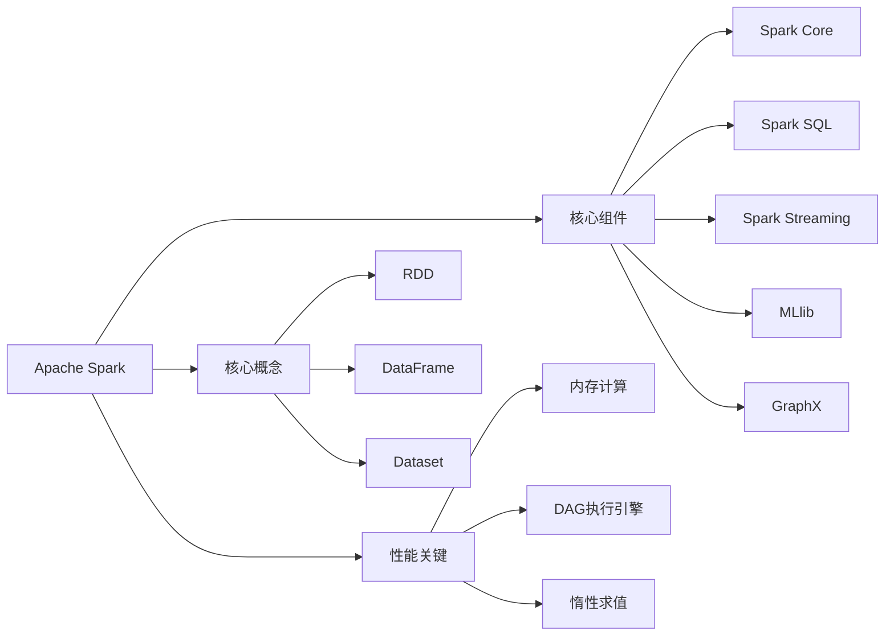
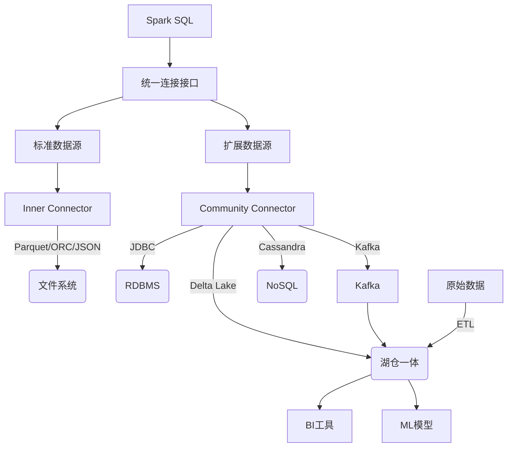

## 第一部分 Apache Spark 基础

#### Apache Spark Introduction 

###### Spark Introduction

- **定义：** Apache Spark 是一个**开源的、分布式、统一的计算引擎**，专为大规模数据处理而设计。
- **核心目标：** 提供**高速（Lightning-Fast）**、**易用**且**通用**的数据处理能力。

###### Spark 性能关键

- **内存计算 (In-Memory Computing)：** Spark 尽可能将中间数据**保留在集群内存中**，避免了传统 MapReduce 需要反复读写磁盘的瓶颈，极大提升迭代算法和交互式查询速度。
- **有向无环图 (DAG) 执行引擎：**
  - Spark 将用户程序构建成一个 **DAG（Directed Acyclic Graph）**，表示操作之间的依赖关系。
  - **DAG Scheduler** 负责将 DAG 分解成一系列 **Stage（阶段）**。
  - **Task Scheduler** 将 Stage 内的任务 (**Task**) 分发到集群节点并行执行。
  - 这种机制允许进行**全局优化**（如流水线执行、任务合并），比 MapReduce 的固定 map-shuffle-reduce 模型更高效。
- **惰性求值 (Lazy Evaluation)：**
  - Spark 在遇到 **Transformations（转换操作，如 `map`, `filter`, `join`)** 时，并不会立即计算，而是记录元数据，构建执行计划。
  - 只有当遇到 **Actions（行动操作，如 `count`, `collect`, `save`)** 时，才会触发整个 DAG 的优化和执行。
  - 允许 Spark 进行**整体优化**（Catalyst 优化器），减少不必要的数据移动和计算。

###### Spark Component

- **Spark SQL / DataFrame & Dataset API：** 处理**结构化/半结构化数据**。支持 SQL 查询、ETL、读写各种数据源，最主流的 API。
- **Spark Streaming ：** 处理**实时流数据**。提供基于微批处理或持续处理模型的、高吞吐、可容错的流处理能力。
- **MLlib：** **机器学习**库。提供常见的机器学习算法（分类、回归、聚类、推荐等）和工具（特征工程、模型评估、流水线）。
- **GraphX：** **图计算**库。用于处理图结构数据（社交网络、推荐关系等），提供图算法和操作。
- **Spark Core：** 提供最基础的**分布式任务调度、内存管理、容错机制、RDD API**，是整个 Spark 生态的基石。

###### Core Conception

- **RDD (Resilient Distributed Dataset)：** **弹性分布式数据集**，是 Spark 最底层的、不可变的、分区的数据集合抽象。
- **DataFrame：** 基于 RDD 以**命名列 (Named Columns)** 组织的**分布式数据集合**，具有 Schema 信息，Spark SQL 的核心抽象。
- **Dataset：** 在 DataFrame 之上增强的 API。提供**类型安全 (Type-Safe)** 的编程接口（在 Scala 和 Java 中）。



## 第二部分 结构化 API——DataFrame、SQL 和 Dataset

#### Apache Spark 的结构化 API

###### 核心特性解析

- **统一编程模型**

  - **批流一体**：相同 API 处理静态数据与实时流。

  - **多语言支持**：Scala/Java/Python/R 统一接口。

  - **多引擎整合**：SQL/MLlib/GraphX 共享执行引擎。

- **惰性执行与优化（Catalyst优化）**：分析逻辑计划 -> 逻辑优化（谓词下推/常量折叠） -> 物理计划生成 -> 代码生成。

- **结构化数据操作**

  | 操作类型                 | 示例                             | 特点                      |
  | :----------------------- | :------------------------------- | :------------------------ |
  | **转换(Transformation)** | `select()`, `filter()`, `join()` | 惰性执行，返回新DataFrame |
  | **行动(Action)**         | `show()`, `count()`, `write()`   | 触发实际计算              |
  | **聚合**                 | `groupBy().agg()`                | 支持窗口函数              |
  | **UDF**                  | `spark.udf.register()`           | 向量化优化执行            |

#### 结构化 API 基础——DataFrame

###### 数据源统一架构


- **核心组件：**

  - **DataFrameReader**：入口：`spark.read`；支持格式：`csv`, `json`, `parquet`, `orc`, `jdbc` 等。

  - **DataFrameWriter**：入口：`df.write`；输出模式：`append`, `overwrite`, `ignore`, `errorIfExists`。

###### 内置数据源

- **Parquet (默认格式)**：列式存储，高效压缩，支持谓词下推。
- **ORC**：优化的行列式文件，行组内按列存储，适用于查全表的场景。
- **数据源格式**：CSV、JSON、JDBC 数据库连接。

- **分区发现（Partition Discovery）**：当读取分区目录结构时自动识别分区。

- **谓词下推（Predicate Pushdown）**：将过滤条件下推到数据源层，减少磁盘I/O。

- **压缩算法**

  | 格式    | 压缩算法 | 压缩率 | 速度 |
  | :------ | :------- | :----- | :--- |
  | Parquet | SNAPPY   | ★★★☆   | ★★★★ |
  | ORC     | ZLIB     | ★★★★☆  | ★★★  |
  | CSV     | GZIP     | ★★★★   | ★★   |

#### Spark SQL 与外部数据源

###### Spark SQL

- **Catalyst 优化器**

  - **解析**：SQL 语句 → 未绑定的逻辑计划。

  - **绑定**：结合元数据→ 已绑定的逻辑计划。

  - **优化**：应用规则（列裁剪、谓词下推等）→ 优化后的逻辑计划（Optimized Logical Plan）。

  - **物理计划生成**：转换为可执行的 SparkPlan（RDD 操作）。

- **执行引擎**
  - 将物理计划转为 RDD 操作，利用 Spark Core 的分布式计算能力。
  - 支持 **Code Generation（代码生成）**，动态编译优化逻辑为字节码，减少虚函数调用。

- **Hive On MapReduce & Spark SQL**

  |     指标     | Hive on MapReduce |    Spark SQL     |
  | :----------: | :---------------: | :--------------: |
  |   执行引擎   | MapReduce（磁盘） |   RDD（内存）    |
  |    优化器    |  Hive Optimizer   |     Catalyst     |
  |     延迟     |   高（分钟级）    |    低（秒级）    |
  | 复杂查询支持 |       有限        | 强（窗口函数等） |

###### 外部数据源架构



#### Dataset 类型安全 API (Dataset API)

###### Dataset API

- **编译时类型检查**：由编程语言（Scala/Java）编译器在代码运行前检测类型错误。
- **面向对象操作**：可直接使用对象方法（如 `user.name`），而非字符串表达式（如 `col("name")`）操作数据。
- **性能优化**：结合 DataFrame 的 Catalyst 优化器与 RDD 的 Lambda 函数优势。

###### 类型安全（Type-Safety）

|  **错误阶段**  |    **DataFrame（弱类型）**     |              **Dataset（强类型）**               |
| :------------: | :----------------------------: | :----------------------------------------------: |
| **编译时检查** |   ❌ 类型错误需运行时才能发现   | ✅ 编译时直接报错（如字段名拼写错误、类型不匹配） |
| **运行时检查** | ✅ 可运行，但可能因类型问题失败 |             ✅ 错误在编译阶段已被排除             |

###### 核心特性

- **编程接口更自然**：可直接使用类成员和方法。

- **Lambda 函数支持**：结合函数式编程处理数据。

- **与 Catalyst 优化器协作**：类型操作会被 Catalyst 解析为逻辑计划，**不影响执行优化性能**。

- **编译时类型安全聚合 (UDAF)**：自定义类型安全的聚合函数。

## 第三部分 低级 API——RDD 与分布式变量

#### RDD Programming

###### RDD 核心架构与特性

- **分区（Partitions）**：数据被切分为多个分区；每个分区在集群节点上独立处理；分区是并行计算的基本单位。
- **计算函数（Compute Function）**：每个分区应用相同的转换函数；惰性执行机制。

- **依赖关系（Dependencies）**
  - **窄依赖**：1个父分区 → 1个子分区（map、filter）。

  - **宽依赖**：1个父分区 → 多个子分区（groupByKey、join）。

- **分区器（Partitioner）**：仅存在于键值对RDD；决定数据如何分区，HashPartitioner（默认）、RangePartitioner（有序数据）
- **优先位置（Preferred Locations）**：数据本地性优化；"移动计算而非数据"原则。


###### RDD 操作类型

- **转换操作（Transformations）**
  - **单RDD**：`map()`, `filter()`, `distinct()`，无shuffle。
  - **双RDD**：`union()`, `intersection()`，可能触发Shuffle。
  - **键值对**：`reduceByKey()`, `join()`，通常有Shuffle。

- **行动操作（Actions）**
  - **collect**：全量数据返回到Driver
  - **take**：取前n条数据。
  - **count**：元素总数。
  - **reduce**：聚合操作。
  - **foreach**：分布式遍历。
- **聚合操作（Aggregate）**
  - **groupByKey**：全量数据移动，效率较差。
  - **reduceByKey**：先局部聚合，性能高效。
  - **aggregateByKey**：自定义聚合，较为灵活。
  - **combineByKey**：最底层的API，高度定制化。


###### RDD 持久化策略

- **存储级别矩阵**

  | 级别              | 内存 | 磁盘 | 序列化 | 副本 | 适用场景     |
  | :---------------- | :--- | :--- | :----- | :--- | :----------- |
  | `MEMORY_ONLY`     | ✓    | ✗    | ✗      | 1    | 默认策略     |
  | `MEMORY_ONLY_SER` | ✓    | ✗    | ✓      | 1    | 减少内存占用 |
  | `MEMORY_AND_DISK` | ✓    | ✓    | ✗      | 1    | 内存不足时   |
  | `DISK_ONLY`       | ✗    | ✓    | ✗      | 1    | 超大数据集   |
  | `OFF_HEAP`        | -    | -    | ✓      | 1    | 避免GC影响   |

## 第四部分 Spark执行模型及性能优化

#### Spark 执行模型

###### 执行流程分层架构

- **用户代码层**：开发者编写的 Spark 应用（Transformations/Actions）。
- **逻辑计划层**：未优化的计算逻辑表示。
- **物理计划层**：优化后的可执行计划。
- **分布式执行层**：集群上的任务调度与执行。

###### 核心执行阶段

- **逻辑计划生成**：解析操作依赖关系；构建抽象语法树（AST）；生成未优化的逻辑计划。

- **物理计划优化（Catalyst引擎）**
  - **优化流程**：解析列/表元数据、（逻辑优化）应用启发式规则、（物理规划）生成可执行计划、（代码生成）编译为字节码。
  - **核心优化规则**：谓词下推、常量折叠、列裁剪、连接重排序。

- **DAG调度与Stage划分**：遇到宽依赖（Shuffle）时划分Stage边界；窄依赖操作合并到同一Stage；形成有向无环图（DAG）。

- **任务调度与执行**

  - **任务层级结构**：

    > Job：由Action触发的完整计算。
    >
    > Stage：由无Shuffle依赖的任务组成。
    >
    > TaskSet：相同Stage的任务集合。
    >
    > Task：最小执行单元（处理单个分区）。

  - **任务调度流程**：

    **DAGScheduler**提交TaskSet ➡️ **TaskScheduler**分配资源 ➡️ **Executor**启动Task线程 ➡️ **Task**读取数据并计算➡️ 结果返回

    ```mermaid
    graph LR
        Driver[Driver程序] -->|创建逻辑计划| DAG[DAGScheduler]
        DAG -->|划分Stage| TaskScheduler[TaskScheduler]
        TaskScheduler -->|分发任务| Executor[Executor]
        Executor -->|执行Task| Worker[Worker节点]
        Worker -->|返回结果| Driver
    ```

###### 内存管理机制

- **执行内存**：Shuffle/Join/Sort等操作。
- **存储内存**：缓存数据和广播变量。
- **动态调整**：执行和存储内存可相互借用。

#### Spark性能调优

###### 资源层优化

- **Executor配置公式**
  - 实例数 = (集群总核数 - 预留核数) / 单Executor核数。
  - 内存 = (容器内存 - 1GB) × 0.9（预留10%系统内存）。
  - 核数 = 4-5（避免超额订阅）。
- **Driver配置策略**
  - 常规作业：4核8GB。
  - 大作业：8核16GB。
  - 需collect数据：内存 ≥ 数据集大小 × 1.5。
- **统一内存模型**
  - 执行内存(60%)：Shuffle/Join/Sort操作。
  - 存储内存(20%)：缓存数据和广播变量。
  - 用户内存(20%)：UDF等用户数据结构。
- **堆外内存优化**：直接操作二进制数据，绕过JVM限制。

###### 执行引擎调优

-  **Catalyst优化器**
   - **核心优化规则**：谓词下推提前过滤数据、列裁剪减少处理字段、常量折叠，预先计算常量表达式、优化Join顺序。
   - **高级特性**：动态分区裁剪，运行时过滤分区；嵌套字段裁剪，处理复杂结构

- **Tungsten引擎**
  - **堆外内存管理**：绕过JVM堆内存限制；减少GC暂停时间；直接操作二进制数据。
  - **缓存感知计算**：优化数据布局（列式存储）；提高CPU缓存命中率；向量化处理指令。
  - **全阶段代码生成**：将查询编译为单个函数；消除虚拟函数调用；生成JVM字节码或本地代码。
- **Shuffle机制演进**
  - **Hash Shuffle**（弃用）：每个Mapper为每个Reducer创建文件；产生O(M*R)个文件（M=Mapper, R=Reducer）
  - **Sort Shuffle**（默认）：Mapper端排序和合并；每个Mapper输出单个索引文件+数据文件；显著减少小文件数量。

###### 数据处理优化

- **分区策略**

  | 场景         | 适用策略   | 优势             |
  | :----------- | :--------- | :--------------- |
  | 均匀数值数据 | Range分区  | 有序数据高效处理 |
  | 键值分布不均 | 自定义分区 | 解决数据倾斜     |
  | 高频Join操作 | 协同分区   | 避免Shuffle      |
  | 时间序列     | 时间分区   | 加速时间范围查询 |

- **数据倾斜**
  - **检测**：识别热点Key（`groupBy().count()`）。
  - **隔离**：分离倾斜Key与非倾斜Key。
  - **分治**：倾斜Key添加随机后缀处理。
  - **合并**：聚合分治结果。