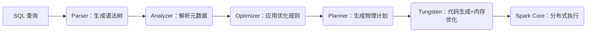

## 第一部分 Spark SQL 基础

#### Spark SQL 架构概述

###### 架构核心组件

- **API层（用户接口）**

  - **输入方式：**SQL查询；DataFrame/Dataset API。
  - **统一性：** 所有接口最终转换为**逻辑计划树（Logical Plan）**，进入优化流程。

- **编译器层（Catalyst 优化器）**

  - **核心引擎：** 基于规则的优化器（**Rule-Based Optimizer, RBO**）与成本优化器（**Cost-Based Optimizer, CBO**）。

  - **处理流程：**

    | 阶段     | 输入           | 输出               | 关键动作                                                  |
    | :------- | :------------- | :----------------- | :-------------------------------------------------------- |
    | **解析** | SQL/API 操作   | **未解析逻辑计划** | 构建语法树（AST），校验语法正确性                         |
    | **分析** | 未解析逻辑计划 | **解析后逻辑计划** | 绑定元数据（表/列名、数据类型）、解析函数、检查语义正确性 |
    | **优化** | 解析后逻辑计划 | **优化后逻辑计划** | 应用优化规则（如谓词下推、列剪裁、常量折叠、连接重排序）  |

  - **优化规则示例：**

    > **Predicate Pushdown（谓词下推）**：将过滤条件推至数据源层，减少 I/O。
    >
    > **Column Pruning（列裁剪）**：仅读取查询涉及的列，减少数据传输。

- **执行计划层（Planner）**

  - **物理计划生成：**将优化后的逻辑计划转换为**物理计划（Physical Plan）**。

  - **策略匹配：** 根据数据分布、资源情况选择最优执行策略（如 `BroadcastHashJoin` vs `SortMergeJoin`）。

  - **物理优化：**

    > **全阶段代码生成（Whole-Stage Codegen）**：将多个操作合并为单个 JVM 函数，减少虚函数调用开销。
    >
    > **谓词下推至数据源**：支持 Parquet/ORC 等格式的过滤条件下推。

- **执行引擎层（Tungsten + Spark Core）**

  - **Tungsten 引擎：**

    > **堆外内存管理**：避免 JVM GC 开销，直接操作二进制数据。
    >
    > **向量化计算**：按列处理数据，提升 CPU 缓存命中率。

  - **分布式执行：**

    > 物理计划转为 **RDD DAG** → 分解为 **Stage** → 调度 **Task** 到 **Executor** 并行执行。
    >
    > 利用 **Spark Core** 的血缘（Lineage）、内存管理、Shuffle 服务。

###### 关键性能技术

- **Catalyst 优化器**
  - **动态优化：** 在逻辑计划阶段应用启发式规则，减少冗余计算。
  - **自适应查询（AQE, Spark 3.0+）**：运行时根据 Shuffle 数据量动态调整 Join 策略、分区数。
- **Tungsten 执行引擎**
  - **内存效率：** 紧凑二进制格式存储数据，减少内存占用 50%+。
  - **代码生成：** 将查询编译为字节码，性能接近手写代码。
- **统一数据源接入**
  - **Data Source API V2：** 支持扩展自定义数据源（如 Kafka、Cassandra），并实现下推优化。



#### Spark SQL 基础实现

- 

#### Spark SQL高级语法

###### 复杂数据类型

- **数组 (ARRAY<T>)**：同类型元素的有序集合（索引从0开始）。

  - **size()**：数组长度。
  - **explode()**：展开数组为多行。
  - **array_contains(arr, value)**：检查元素是否存在。
  - **transform(arr, x -> x * 2)**：对每个元素应用Lambda函数。

- **映射(MAP<K,V>)**：键值对集合（键唯一）。

  - **element_at(map, key)**：按键取值。

  - **map_keys()/map_values()**：获取所有键/值。

  - **map_concat(map1, map2)**：合并两个Map。

- **结构体 (`STRUCT<field1:T1, ...>`)**：包含多个字段的复合类型（类似JSON对象）。

###### 高级聚合与分组

- **GROUPING SETS**：自定义聚合维度组合，无关字段用NULL值填充。

  ```SQL
  SELECT city, department, SUM(salary) AS total_salary
  FROM employees
  GROUP BY GROUPING SETS (
      (city, department), (city), ()                  
  )
  ```

- **ROLLUP**：层级聚合

  ```sql
  SELECT country, province, city,COUNT(*) AS count
  FROM locations
  GROUP BY ROLLUP(country, province, city)
  -- SQL结果会显示（country, province, city）、（country, province）、（country）、（）的聚合结果
  ```

- **CUBE**：所有维度聚合

  ```sql
  SELECT year, product, SUM(revenue) 
  FROM sales
  GROUP BY CUBE(year, product)
  -- SQL结果会显示（year, profucr）、（year）、（product）、（）的聚合结果
  ```

- **聚合过滤（FILTER 子句）**：对特定条件聚合 (比WHERE更高效)

  ```sql
  SELECT department,
      SUM(salary) FILTER (WHERE age > 30) AS senior_salary,
      AVG(salary) FILTER (WHERE gender = 'F') AS female_avg
  FROM employees
  GROUP BY department
  ```

###### Spark SQL连接实现算法

- **Shuffled Hash Join（分区哈希连接）**

  - **Shuffle阶段**：两表数据按 Join Key 重新分区；相同 Key 的数据发送到同一 Executor。
  - **Build阶段**：每个 Executor 将**小分区**数据构建内存哈希表。
  - **Probe阶段**：扫描**大分区**数据，在哈希表中查找匹配项。

  - **适用场景**：**中等规模数据集**（单分区数据可装入内存）；**Key分布均匀**，无严重数据倾斜；两表规模相当（无显著大小差异）。

- **Broadcast Hash Join（广播哈希连接）**
  - **广播阶段**：Driver 将**小表全量数据**发送给所有 Executor。
  - **构建阶段**：Executor 在内存中构建**哈希表**。
  - **探测阶段**：扫描**本地大表分区**数据，直接匹配。
  - **适用场景**：**小表 + 大表** 组合（小表 < 10MB 默认）；小表数据可完全装入 Executor 内存；网络带宽充足（广播有网络开销）。

- **Broadcast Nested Loop Join（广播嵌套循环连接）**
  - **广播阶段**：将**右侧表**全量广播到所有 Executor
  - **嵌套循环**：对左侧表每条记录，遍历广播表所有记录；应用 Join 条件判断是否匹配。
  - **适用场景**：**非等值连接**（>, <, BETWEEN）；带复杂条件（UDF 函数）；极小表 + 大表组合；笛卡尔积计算。

- **Sort Merge Join（排序合并连接）**
  - **Shuffle阶段**：两表按 Join Key **分区并排序**。
  - **合并阶段**：使用**双指针**同步遍历有序数据；当 Key 匹配时输出结果。
  - **适用场景**：**超大规模数据集**（TB级以上）；内存资源有限；Key 有序或可接受排序开销；处理数据倾斜场景。

###### 窗口函数

- **核心结构**

  ```sql
  SELECT
      RANK() OVER (
          PARTITION BY dim 
          ORDER BY metric DESC
          ROWS BETWEEN UNBOUNDED PRECEDING AND CURRENT ROW -- 窗口范围
      ) AS rank
  FROM table
  ```

- **聚合函数**：**SUM()、AVG()、COUNT()、MAX()、MIN()**等

- **排名函数**：

  - **ROW_NUMBER()**：为窗口内的每一行分配一个唯一的序号，序号连续且不重复。
  - **RANK()**：排名函数，允许有并列的名次，名次后面会出现空位。
  - **DENSE_RANK()**：排名函数，允许有并列的名次，名次后面不会空出位置，即序号连续。

- **分组窗口函数**：

  - **NTILE()**：将窗口内的行分为指定数量的组，每组的行数尽可能相等。

- **分布窗口函数**

  - **PERCENT_RANK()**：计算每一行的相对排名，返回一个介于0到1之间的值，表示当前行在分区中的排名百分比。
  - **CUME_DIST()**：计算小于或等于当前行的行数占窗口总行数的比例。

- **取值窗口函数**

  - **LAG()**：访问当前行之前的第n行数据。
  - **LEAD()**：访问当前行之后的第n行数据。
  - **FIRST_VALUE()**：获取窗口内第一行的值。
  - **LAST_VALUE()**：获取窗口内最后一行的值。
  - **NTH_VALUE()**：获取窗口内第n行的值，如果存在多行则返回第一个。

- **窗口范围**

  - **UNBOUNDED PRECEDING**：从分区中的第一行开始（前面所有行）。
  - **CURRENT ROW**：包括当前行。
  - **N PRECEDING**：从当前行之前的第 nN行开始。
  - **N FOLLOWING**：包括当前行之后第 N 行。
  - **UNBOUNDED FOLLOWING**：到分区中的最后一行结束（后面所有行）。

###### Spark SQL内置函数

- **聚合函数 (Aggregate Functions)**

  | 函数                      | 返回值 | 说明                        |
  | :------------------------ | :----- | :-------------------------- |
  | **approx_count_distinct** | Long   | 近似去重计数 (rsd=相对误差) |
  | **collect_list**          | Array  | 收集值到数组 (保留重复)     |
  | **collect_set**           | Array  | 收集值到集合 (去重)         |
  | **corr**                  | Double | 相关系数 (-1~1)             |
  | **covar_pop/covar_samp**  | Double | 总体/样本协方差             |
  | **kurtosis**              | Double | 峰度                        |
  | **skewness**              | Double | 偏度                        |
  | **percentile_approx**     | Double | 近似百分位数                |

- **数组函数 (Array Functions)**

  | 函数                         | 说明       |
  | :--------------------------- | :--------- |
  | **array(e1, e2, ...)**       | 转换为数组 |
  | **array_contains(arr, val)** | 数组包含   |
  | **array_distinct**           | 数组去重   |
  | **array_position(arr, val)** | 数组索引值 |
  | **size**                     | 数组大小   |

- **Map 函数 (Map Functions)**

  | 函数                     | 说明               |
  | :----------------------- | :----------------- |
  | **map(k1,v1, k2,v2)**    | 转化为map          |
  | **element_at(map, key)** | 根据键获取值       |
  | **map_keys/map_values**  | 获取键列表、值列表 |
  | **map_entries**          | 获取map entry      |

- **日期时间函数 (Datetime Functions)**

  | 函数                  | 说明     | 示例                                          |
  | :-------------------- | :------- | :-------------------------------------------- |
  | **date_add/date_sub** | 日期加减 | `date_add('2025-07-01', 7)` → `2025-07-08`    |
  | **datediff**          | 日期差   | `datediff('2025-06-01','2025-06-30')` → `30`  |
  | **date_format**       | 格式化   | `date_format(ts, 'yyyy-MM')` → `"2025-07"`    |
  | **trunc**             | 截断日期 | `trunc('2025-07-01', 'MONTH')` → `2025-07-01` |
  | **window**            | 时间窗口 | 流处理中按时间聚合                            |

- **JSON 函数 (JSON Functions)**

  | 函数                | 说明         | 示例                                                   |
  | :------------------ | :----------- | :----------------------------------------------------- |
  | **get_json_object** | JSON路径取值 | `get_json_object('{"a":1}', '$.a')` → `1`              |
  | **json_tuple**      | 多字段提取   | `json_tuple('{"name":"Bob"}', 'name')` → `Bob`         |
  | **from_json**       | 解析为结构体 | `from_json('{"id":1}', 'id INT')`                      |
  | **to_json**         | 结构体转JSON | `to_json(struct('Tom' AS name))` → `'{"name":"Tom"}'`  |
  | **schema_of_json**  | 推断Schema   | `schema_of_json('[{"a":1}]')` → `ARRAY<STRUCT<a:INT>>` |

- **字符串函数 (String Functions)**

  | 函数               | 说明             | 示例                                                    |
  | :----------------- | ---------------- | :------------------------------------------------------ |
  | **concat_ws**      | 字符串拼接join   | `concat_ws('-','2025','07')`→`"2025-07"`                |
  | **split**          | 字符串解析转数组 | `split('a,b,c', ',')`→`["a","b","c"]`                   |
  | **regexp_extract** | 正则表达式       | `regexp_extract('id=100','id=(\\d+)',1)`→`"100"`        |
  | **translate**      | 字符串子串转化   | `translate('hello','el','ip')`→`"hippo"`                |
  | **parse_url**      | 解析URL          | `parse_url('http://a.com?q=spark','QUERY')`→`"q=spark"` |

## 第二部分 Spark SQL 核心技术

#### Spark SQL 编译器 Catalyst


#### Spark SQL 执行引擎计划生成


#### Spark SQL 执行引擎之 Tungsten


## 第三部分 Spark SQL 高级特性实现

#### Spark SQL 数据源


#### Spark SQL 扩展


## 第四部分 性能优化篇

#### Spark SQL 性能优化