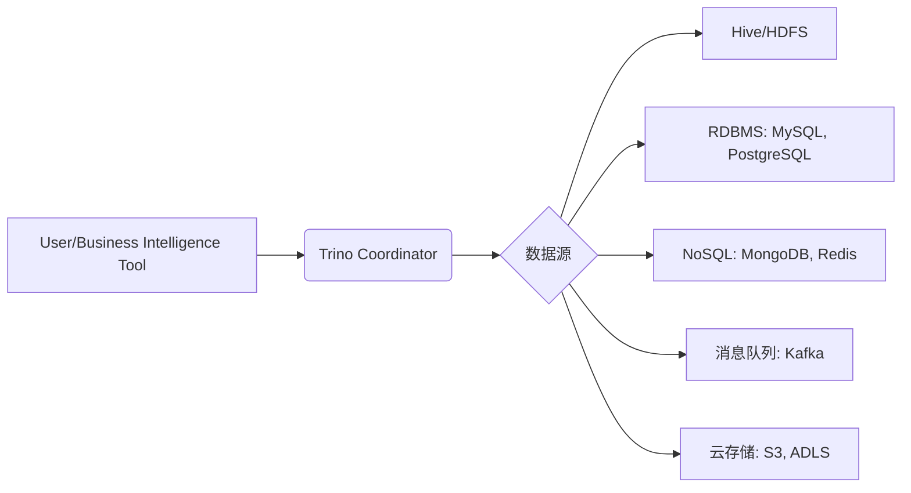
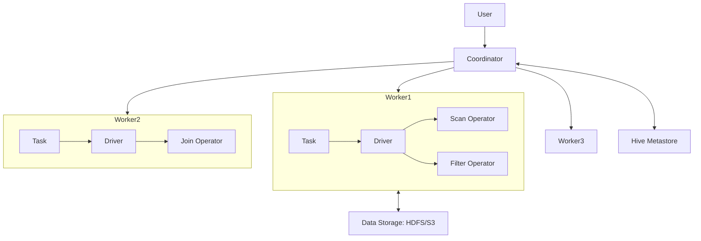
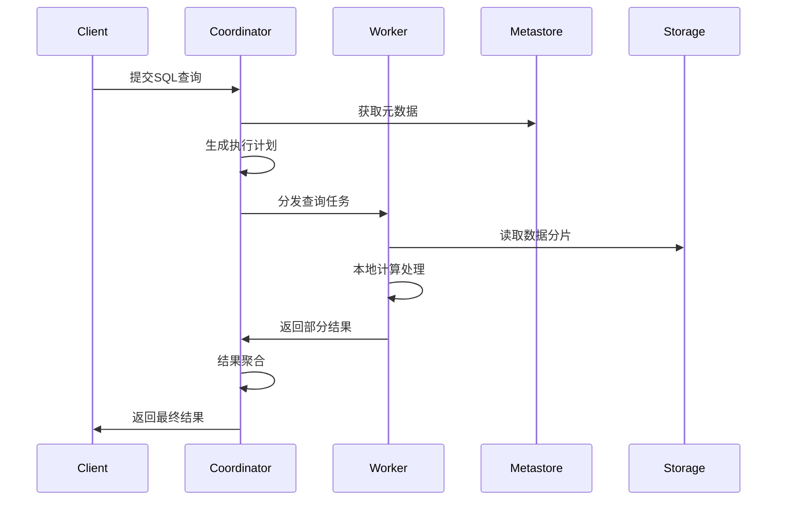
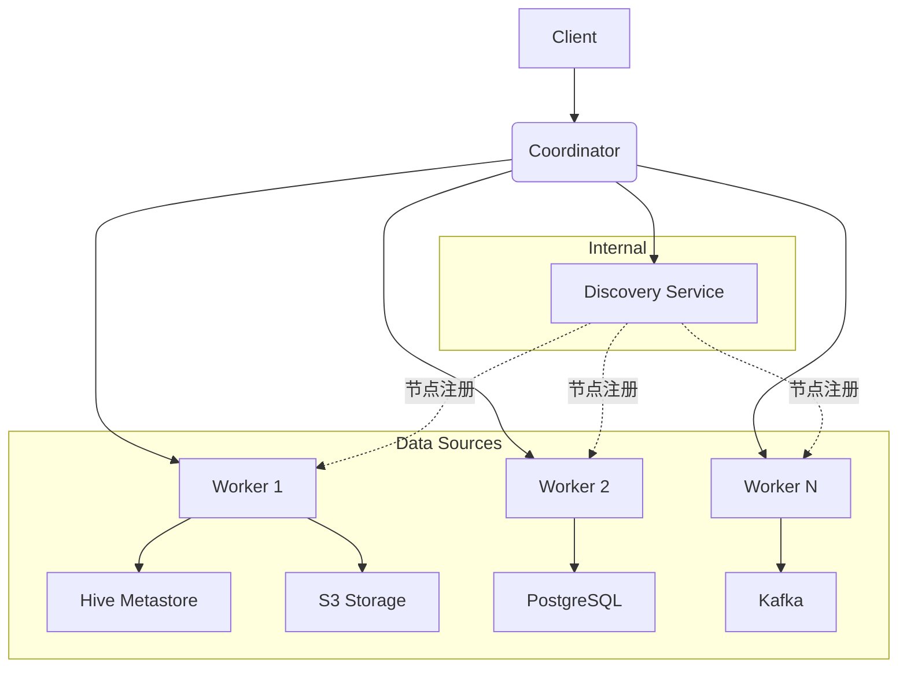
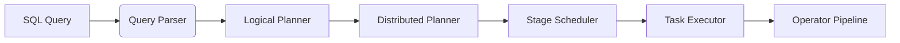

## Part I:  Trino Fundamentals 

#### Trino Introducing

- **定义**：Trino（原Presto SQL）是一个**开源的分布式SQL查询引擎**，专为**大数据联邦查询**设计。
- **核心目标**：支持秒级查询海量数据（PB级）；无缝查询异构数据源（Hive、MySQL、Kafka、Redis等）。



###### Trino核心特性

| **特性**       | **传统数仓/引擎**   | **Trino**                    | **优势场景**             |
| :------------- | :------------------ | :--------------------------- | :----------------------- |
| **查询速度**   | 分钟~小时级         | **秒~分钟级**                | 交互式分析、BI报表       |
| **数据源支持** | 单一存储            | **联邦查询**（跨20+连接器）  | 统一访问异构数据源       |
| **架构扩展性** | 固定集群            | **弹性伸缩**（无状态Worker） | 按需扩容降低成本         |
| **使用成本**   | 高（商业授权/硬件） | **开源+云原生**              | 避免厂商锁定，支持容器化 |

###### 技术架构核心组件

- **Coordinator（协调器）**：接收SQL请求，解析生成**分布式执行计划**；调度Task到Worker，监控查询状态。
- **Worker（工作节点）**：执行**Task**（数据扫描、过滤、聚合等操作）；通过**Driver**驱动多个**Operator**（最小执行单元）。
- **连接器（Connector）**：解耦计算与存储，通过插件支持新数据源；关键接口：`getSplits()`（数据分片）、`getPage()`。



###### Using Trino



## Part II: Trino in Depth(Trino深入解析)

#### Trino Architecture (Trino架构)

###### 分层架构设计

- **协调层(Coordinator)**：集群大脑
  - SQL解析器：语法树生成
  - 优化器：基于成本的查询优化(CBO)
  - 调度器：分布式任务分配
  - 资源管理器：全局资源配额控制
- **计算层(Worker)**：并行执行引擎
  - 任务执行器：Task处理单元
  - 驱动池：多线程执行引擎
  - 内存管理器：精细化内存控制
- **连接层(Connector)**：存储抽象
  - 统一接口：getSplits(), getPage()
  - 数据源适配器：Hive/S3/RDBMS等



###### Coordinator（协调器）深度解析

- **SQL解析与优化**
  - 语法解析 → 语义验证 → 逻辑计划 → CBO优化
  - 优化手段：谓词下推、Join重排序、Limit下推
- **资源管理**：全局资源组配置；查询优先级队列；内存池监控。

###### Worker（工作节点）执行引擎

- **Task**：最小调度单元；包含多个Driver实例；状态机：PLANNED → RUNNING → FINISHED/FAILED。
- **Driver**：执行线程的基本单位；包含Operator管道；内存控制单元。
- **Operator**：原子操作实现，类型如下：
  - **数据源**：`TableScanOperator`
  - **转换**：`FilterOperator`, `ProjectOperator`
  - **聚合**：`HashAggregationOperator`
  - **Join**：`HashBuilderOperator`, `LookupJoinOperator`

###### 关键执行流程

- **查询解析阶段**：SQL → 抽象语法树 → 逻辑计划 → 优化计划。
- **分布式调度阶段**：Stage间构成流水线(Pipeline)；Task为最小调度单元；Split对应数据分片。
- **内存计算阶段**：列式内存格式(Page)；向量化处理(每个Page 1024行)；操作符流水线(避免物化中间结果)。

###### 核心设计思想

- **无共享架构(Shared Nothing)**：Worker完全独立；无磁盘写依赖；线性扩展能力。
- **全内存流水线**：各Operator间通过内存Page直接传递数据。
- **动态代码生成**：运行时生成优化字节码；消除虚函数调用；特定数据类型特化。
- **异步I/O模型**：网络与计算重叠；非阻塞数据获取；流水线气泡最小化。

###### 关键优化技术

- **数据局部性优化**：Split调度亲和性；网络拓扑感知；动态过滤(Dynamic Filtering)。
- **资源隔离机制**：多级配额控制(CPU/内存/并发)。
- **弹性内存管理**：内存分级(执行/系统/预留)；智能溢出(Spill to SSD)；OOM防护机制。

###### 连接器设计精髓

- **元数据抽象**：统一表/列/分区视图；跨源schema映射。
- **谓词下推优化**：过滤条件下推到数据源。
- **分片并行处理**：自动分裂大文件(>64MB)；并行读取小文件合并；ORC/Parquet列式加速。

#### Query Execution(查询执行)

###### 分布式执行模型详解



- **四级执行抽象层**

  | **层级**     | **职责**        | **并行度**       | **生命周期**     |
  | :----------- | :-------------- | :--------------- | :--------------- |
  | **Query**    | 完整SQL执行单元 | 全局唯一         | 客户端提交到结束 |
  | **Stage**    | 执行计划子图    | 多Worker         | Query生存期内    |
  | **Task**     | Stage的分区实例 | 每Worker多Task   | Stage执行期间    |
  | **Operator** | 原子计算操作    | 每Task多Operator | Task执行期间     |

- **Stage拓扑类型**
  - **SOURCE Stage**：直接对接数据源（HDFS/S3/RDBMS）；并行度 = 数据分片数（Split）；仅包含Scan类Operator。
  - **FIXED Stage**：承担Shuffle数据交换；并行度由`hash_partition_count`配置；包含Join/Aggregate等复杂Operator。
  - **SINGLE Stage**：最终结果汇聚；单点执行（Coordinator或指定Worker）；负责Order By/Limit等全局操作。
- **数据交换模式**
  - **Local Exchange**：Worker内部Task间数据传输。
  - **Global Exchange**：跨Worker数据重分布。
  - **Exchange Client**：管理网络连接与数据缓冲。

###### 内存计算引擎核心设计

- **列式内存结构（Page）**

  | **组件**             | **描述**              | **优化价值**     |
  | :------------------- | :-------------------- | :--------------- |
  | **Block**            | 单列数据容器          | 列式处理加速聚合 |
  | **Page**             | 1024行Blocks的集合    | CPU缓存友好      |
  | **Position Count**   | 实际行数（可能<1024） | 处理尾部数据     |
  | **Dictionary Block** | 字典编码块            | 高基数列内存压缩 |

- **操作符流水线**
  - **批处理**：单次处理整Page而非单行。
  - **延迟物化**：保持编码数据直至必须解码。
  - **短路执行**：Limit条件下提前终止。

- **内存管理机制**
  - **执行内存**：Operator计算过程占用。
  - **系统内存**：数据结构开销（Hash表等）。
  - **预留内存**：保障关键操作不被中断。

###### 高级优化策略体系

- **分布式Join优化**

  | **策略**           | **适用场景**              | **数据移动代价** |
  | :----------------- | :------------------------ | :--------------- |
  | **Broadcast**      | 维度表(<1GB)              | O(N)             |
  | **Partitioned**    | 双大表                    | O(N+M)           |
  | **Colocated**      | 同分布键的事实-事实表Join | O(1)             |
  | **Dynamic Filter** | 星型模型Join              | 下推减少源数据   |

- **动态运行时优化**

  - **自适应并行度**：基于数据量动态调整Task数；小数据集自动降级到单Task处理；倾斜分区识别与特殊处理。
  - **动态过滤工作流**

  ```mermaid
  sequenceDiagram  
      participant D as 维度表Stage  
      participant F as 事实表Stage  
      D->>F: 发送过滤条件(min/max值)  
      F->>F: 应用过滤条件扫描数据  
      F->>Coordinator: 返回过滤后数据  
  ```

- **连接器级加速（ORC/Parquet优化）**

  - **行组跳过**：基于统计信息过滤数据块
  - **布隆过滤**：快速判断值是否存在
  - **延迟加载**：仅读取需要的列块

#### Connectors(连接器)

###### 核心设计原则

- **计算存储分离**：Trino不存储数据，只进行计算。
- **统一接口规范**：所有数据源实现相同API。
- **元数据抽象**：统一表/列/分区视图。
- **下推优化**：最大化利用底层存储能力。

###### 三大基础接口

| **接口**                       | **职责**     | **关键方法**                       |
| :----------------------------- | :----------- | :--------------------------------- |
| **ConnectorMetadata**          | 元数据管理   | `listTables()`, `getTableHandle()` |
| **ConnectorSplitManager**      | 数据分片管理 | `getSplits()`                      |
| **ConnectorRecordSetProvider** | 数据读取     | `getRecordSet()`                   |

###### 主流连接器特性

| **连接器**  | 核心优势               | 适用场景           | 下推能力                 |
| :---------- | :--------------------- | :----------------- | :----------------------- |
| **Hive**    | 成熟稳定，兼容Hive生态 | 数据湖查询         | 谓词/分区/列裁剪         |
| **Iceberg** | ACID事务，时间旅行     | 增量ETL，CDC场景   | 高级谓词下推，元数据过滤 |
| **RDBMS**   | 实时数据访问           | 联邦查询，数据融合 | 完整SQL下推              |
| **Kafka**   | 流式数据接入           | 实时监控，事件分析 | 时间范围过滤             |
| **MongoDB** | 文档模型支持           | JSON数据分析       | 字段投影，简单过滤       |

## Part III: Trino Optimization(Trino优化核心)

#### Performance Foundations (性能基础)


#### Query Tuning(查询调优)


#### Advanced Optimization Techniques (高级优化技术)


#### Memory and Resource Management (内存与资源管理)


#### Connector-Specific Tuning (连接器专项调优)