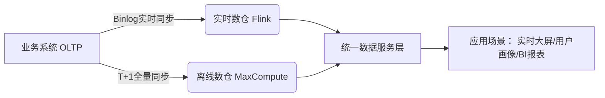

#### 第1章 综述

###### 大数据体系架构图


###### 数据采集层

- **Aplus.JS**：Web端日志采集技术方案。
- **UserTrack**： APP端日志采集技术方案。
- **TimeTunnel**：DB增量数据传输及日志数据传输，支持流式计算和基于时间窗口的批量计算。
- **DataX**：阿里数据同步工具，直连异构数据库来抽取各种时间窗口的数据。

###### 数据计算层

- **MaxCompute**：离线大数据存储及计算平台。
- **StreamCompute**：实时大数据存储及流式计算平台。
- **OneData**：数据整合及管理（如指标体系和数据服务）的方法体系和工具，包含OneID、OneMetric和OneService。
- **离线数仓**：数据计算主要以天为单位（包含小时、周、月），每日凌晨处理T-1的数据。
- **实时数仓**：实时计算更新数据，如实时数据大屏。
- **数仓分层**
  - 操作数据层（ Operational Data Store, ODS） 
  - 明细数据层（ Data Warehouse Detail , DWD ）
  - 汇总数据层（ Data Warehouse Summary, DWS ）
  - 应用数据层（ Application Data Store, ADS ）
- **元数据管理**：数据源元数据、数据仓库元数据 、数据链路元数据、工具类类元数据、数据质量类元数据。
- **元数据应用**：主要面向数据发现、数据管理等 ，如用于存储、计算和成本管理等。

###### 数据服务层

- **OneService**：统一数据服务平台，以数据仓库整合计算好的数据作为数据源，对外通过接口的方式提供数据服务。
- **功能**：提供简单数据查询服务、复杂数据查询服务和实时数据推送服务。

## 第一篇 数据技术篇

#### 第2章 日志采集

###### 浏览器的页面日志采集

- **基础指标**：页面浏览量（ Page View, PV）和访客数（ Unique Visitors, UV ）。
- **页面浏览日志采集流程**
  - **客户端日志采集**：由植入HTML页面的JS脚本来执行，采集脚本被浏览器加载解析后执行。
  - **客户端日志发送**：采集脚本执行时，会向日志服务器发起一个日志请求，以将采集到的数据发送到日志服务器。
  - **服务端日志收集**：服务器接受客户端日志请求后，放入日志缓冲区。
  - **服务端日志解析**：日志处理程序会对日志缓冲区顺序读取并进行处理解析。
- **页面交互日志采集**
  - **步骤一**：业务方在日志服务的元数据管理界面依次注册需要采集交互日志的业务、业务场景和具体的交互采集点。
  - **步骤二**：业务方将交互日志采集代码植入目标页面，并将采集代码与需要检测的用户行为相绑定。
  - **步骤三**：当用户在页面上产生指定行为时，采集代码和正常的业务互动响应代码一起被触发和执行。
  - **步骤四**：采集请求到服务端后，不做解析处理，只做简单的转储。
- **页面日志的服务端清洗和预处理**：识别流量攻击、网络爬虫和流量作弊、数据缺项补正、无效数据剔除、日志隔离分发。

###### APP端的日志采集

- **UserTrack**：利用采集SDK来进行APP端的日志采集。
- **事件类型**：页面事件（页面浏览）和控件点击事件（页面交互）等。
- **页面事件**
  - **日志记录**：①设备及用户的基本信息；②被访问页面的信息及业务参数 ; ③访问基本路径（如页面来源、 来源的来源 ）。
  - **手动埋点**：UserTrack提供三个接口（展现、退出、扩展），分别在页面展现、页面退出时调用记录用户操作信息。
  - **SPM（Super Position Model）**：越级位置模型，可以进行来源去向追踪，通过透传机制还原用户行为路径。
- **控件点击**：①设备信息；②用户信息；③控件所在页面；④控件名称；⑤控件业务参数。
- **其他事件**：①事件名称；②事件时长；③事件所携带的属性；④事件对应的页面。
- **H5&Native日志统一**
  - **步骤一**：H5页面手动植入日志采集的JS脚本。
  - **步骤二**：JS脚本执行时将所采集的数据打包到一个对象，利用WebView的JSBridge进行通信存储到客户端。
  - **步骤三**：移动客户端日志采集 SDK ，封装提供接口，实现将传入的内容转换成移动客户端日志格式。
- **日志传输**：APP端产生日志后先存储在本地，然后伺机上传到服务器，服务端对不同等级的日志需要进行分流。

###### 日志采集的挑战

- **日志分流及定制处理**：日志解析和处理过程中必须考虑业务分流、日志优先级控制，以及根据业务特点实现定制处理。
- **采集与计算一体化设计**
  - **背景**：超大规模日志进行URL分流，使用正则匹配计算时会拖垮整个硬件计算集群。
  - **方案**：通过 SPM 的注册和简单部署即可将任意的页面流量进行聚类得到聚合数据，避免服务端计算。

#### 第3章 数据同步

###### 数据同步基础

- **直连同步**：通过定义好的规范接口API和基于动态链接库的方式直接连接业务数据库，如ODBC/JDBC。
  - **痛点**：执行大量数据同步时会降低甚至拖垮业务系统的性能。
- **数据文件同步**：直接从源系统生成数据的文本文件，由文件服务器传输到目标系统后，加载到目标数据库系统中（如日志同步）。
- **数据库日志解析同步**：以通过源系统的进程，读取归档日志文件用以收集变化的数据信息，将其解析到目标数据文件中。
  - **痛点**：大量数据同步导致数据延迟、数据漂移和遗漏。

###### 阿里数据仓库的同步方式

- **批量数据同步**：多源数据 ➡️ 数据仓库；数据仓库 ➡️ 业务系统。
  - **DataX**：能满足多方向高自由度的异构数据交换服务产品。
  - **Framework + Plugin**： Framework处理缓冲、流程控制、并发、上下文加载。
  - **Job**：数据同步作业。
  - **Splitter**：作业切分模块，将1个大任务分解成多个可以并发行的小任务。
  - **Task**：数据同步作业切分后的小任务。
  - **Reader**：数据读入模块，负责运行切分后的小任务，将数据从源系统装载到 DataX。
  - **Channel**： Reader 和 Writer 通过 Channel 交换数据。
  - **Writer**：数据写出模块，负责将数据从 DataX 导入目标数据系统。
- **实时数据同步**：日志需要快速以数据流的方式不间断地同步到数据仓库。
  - **TimeTunnel**：是一种基于生产者、消费者和 Topic 消息标识的消息中间件，将消息数据持久化到 HBase 的数据交互系统。
  - **生产者**：消息数据的产生端，向 TimeTunnel 集群发送消息数据。
  - **消费者**：消息数据的接收端，从 TimeTunnel 集群中获取数据进行业务处理。
  - **Topic**：消息类型的标识。
  - **Broker**： 负责处理客户端收发消息数据的请求，然后往 HBase 取发数据。

###### 数据同步遇到的问题与解决方案

- **分库分表处理**：通过建立中间状态的逻辑表来整合统一分库分表的访问，如TDDL数据访问引擎。

- **TDDL**：实现了 SQL 解析、规则计算、表名替换、选择执行单元并合并结果集的功能。

  <div>
    <span>
      
    </span>
    <span>
      
    </span>
  </div>


- **高效同步和批量同步**
  - **痛点**：大量重复的数据任务操作、数据源种类太多需要特殊配置。
  - **OneClick**：对不同数据源同步配置透明化，自动生成配置信息；简化步骤，建表、配置任务、发布、测试操作一键化处理。
  - **IDB**：集数据管理、结构管理、诊断优化、实时监控和系统监控于一体的数据管理服务。
- **增量与全量同步的合并**
  - **增量同步**：每次只同步新变更的增量数据到目标系统。
  - **全量同步**：每次同步数据源数据表的所有数据到目标系统。
  - **合并技术**：全外连接（full outer join） + 数据全量覆盖重新加载（insert overwrite）（全量更新比update性能高很多）。
  - **分区技术**：每日调度最新的数据到新的分区，和原来所有分区的数据组成全量数据
- **同步性能处理**
  - **痛点**：部分同步任务分发到CPU比较繁忙的机器会拖垮数据同步性能；数据同步任务无优先级，导致重要同步任务得不到调度。
  - **计算量级**：估算该同步任务需要同步的数据量、平均同步速度、首轮运行期望的线程数、需要同步的总线程数。
  - **数据分发**：根据同步的总线程数将待同步的数据拆分成相等数量的数据块，一个线程处理个数据块。
  - **同步控制**：同步控制器判断待同步的总线程数是否大于首轮运行期望的线程数，大于则跳转至多机处理；否则跳转至单机处理。
  - **多机处理**：准备该任务第一轮线程的调度，优先发送等待时间最长、优先级最高且同步任务的线程。
  - **单机处理**：优先发送等待时间最长、优先级最高且单机 CPU 剩余资源可以支持首轮所有线程数且同任务的线程，如果没有满足条件的机器，则选择 CPU 剩余资源最多的机器进行首轮发送。
- **数据漂移处理**：通常是指 ODS 表的同一个业务日期数据中包含前一天或后凌晨附近的数据或者丢失当天的变更数据。
  - **时间戳字段**：modified_time数据表更新时间；log_time 数据日志更新时间；proc_time数据表业务发生时间；extract_time数据抽取时间。
  - **漂移场景**：数据抽取时间extract_time有延迟；业务系统未更新modified_time；系统压力导致log_time、modified_time延迟。
  - **处理方法**：多获取后一天的数据，业务根据延迟时间确定；通过多个时间戳字段获得相对精确的值。

#### 第4章 离线数据开发

###### 数据开发平台

- **统一计算平台**

  - **MaxCompute**：主要服务于海量数据的存储和计算 ，提供完善的数据导入方案， 以及多种经典的分布式计算模型，提供海量数据仓库的解决方案，能够更快速地解决用户的海量数据计算问题，有效降低企业成本，并保障数据安全。

  - **MaxCompute客户端**：包括Web、SDK、CLT、IDE等形式完成 Project 管理、数据同步、任务调度、报表生成等常见操作。

  - **MaxCompute接入层**：提供HTTP服务、Cache、负载均衡，实现用户认证和服务层面的访问控制。

  - **MaxCompute控制层**：实现用户空间和对象的管理、命令的解析与执行逻辑、数据对象的访问控制与授权等功能。

    > **Worker**：处理所有的RESTful 请求，包括用户空间（ Project ）管理操作、资源（ Resource） 管理操作、作业管理等；对于 SQL DML、MR 等需要启动 MapReduce 的作业，会生成 MaxCompute Instance 提交给 Scheduler 一步处理。
    >
    > **Scheduler**：负责MaxCompute Instance的调度和拆解，并向计算层的计算集群询问资源占用情况以进行流控。
    >
    > **Executor**：负责 MaxCompute Instance 的执行，向计算层的计算集群提交真正的计算任务。

  - **MaxCompute计算层**：包括分布式文件系统（Pangu）、资源调度系统（Fuxi）、NameSpace服务、监控模块。

  - **MaxCompute元数据**：主要包括用户空间元数据、 Table Partition Schema、ACL、Job 元数据、安全体系等。

  - **MaxCompute架构**

    

- **统一开放平台**

  - **D2**：集成任务开发、调试及发布，生产任务调度及大数据运维，数据权限申请及管理等功能的一站式数据开发平台。

  - **Dataworks**：核心功能与D2一致，D2服务与阿里集团内部业务，Dataworks则为阿里云对外商业化大数据开发治理平台。

  - **SQLSCAN**：在任务开发中用户编写的SQL质量差、性能低、不遵守规范等问题，总结成规范，通过系统及研发流程保障。

    >**代码规范类规则**：表命名规范、生命周期设置、表注释等。
    >
    >**代码质量类规则**：调度参数使用检查、分母为0提醒、 NULL 值参与计算影响结果提醒、插入字段顺序错误等。
    >
    >**代码性能类规则**：分区裁剪失效、扫描大表提醒、重复计算检测等。

  - **DQC**：主要关注数据质量， 通过配置数据质量校验规则，自动在数据处理任务过程中进行数据质量方面的监控。

    > **数据监控**：监控数据质量并报警，其本身不对数据产出进行处理，需要报警接收人判断并决定如何处理。
    >
    > **数据清洗**：将不符合既定规则的数据清洗掉，以保证最终数据产出不含“脏数据”，数据清洗不会触发报警。
    >
    > **监控规则**：主键监控、表数据量及波动监控、重要字段的非空监控、重要枚举宇段的离散值监控、 指标值波动监控等。

###### 任务调度系统

- **核心设计模型**

  - **调度引擎**：根据任务节点属性及依赖关系进行实例化， 生成各类参数的实值，并生成调度树。
  - **执行引擎**：根据调度引擎生成的具体任务实例和配置信息，分配 CPU 内存、运行节点等资源，在任务对应的环境中运行代码。

- **任务状态机模型**

  - **预备阶段**：WAITING_DEPENDENCY → READY → WAITING_RESOURCE
  - **执行阶段**：RUNNING（核心处理节点）
  - **终态阶段**：SUCCESS/KILLED/SUSPENDED
  - **异常回路**：FAILED ⇄ WAITING_RETRY

  ```mermaid
  stateDiagram-v2
  		direction LR
      [*] --> WAITING_DEPENDENCY : 任务创建
      WAITING_DEPENDENCY --> READY : 上游依赖满足
      READY --> WAITING_RESOURCE : 提交执行请求
      WAITING_RESOURCE --> RUNNING : 资源分配完成
      RUNNING --> SUCCESS : 执行成功
      RUNNING --> FAILED : 执行异常
      RUNNING --> KILLING : 用户主动终止
      FAILED --> WAITING_RETRY : 重试次数未耗尽
      WAITING_RETRY --> READY : 到达重试时间
      FAILED --> SUSPENDED : 重试次数耗尽
      KILLING --> KILLED : 终止完成
      SUCCESS --> [*] : 生命周期结束
      KILLED --> [*] : 生命周期结束
      SUSPENDED --> READY : 人工干预恢复
      SUSPENDED --> [*] : 人工确认终止
  
      note right of WAITING_DEPENDENCY
          核心依赖检查：
          1. 父任务状态（成功/跳过）
          2. 跨周期依赖满足
          3. 数据分区就绪
          4. 业务日期有效性
      end note
  
      note left of RUNNING
          执行引擎交互：
          - 启动计算引擎（MaxCompute/Hive/Spark）
          - 实时监控资源水位
          - 进度心跳检测（超时自动失败）
          - 日志实时采集
      end note
  
      note right of WAITING_RETRY
          智能重试策略：
          1. 指数退避时间（5s→10s→30s→1m）
          2. 资源不足时自动扩容
          3. 节点故障自动转移
          4. 环境异常自动隔离
      end note
  ```

- **工作流状态机模型**

  ```mermaid
  stateDiagram-v2
      direction LR
      [*] --> NOT_STARTED : 工作流创建
      NOT_STARTED --> RUNNING : 调度时间到达
      RUNNING --> RUNNING : 子任务执行中
      RUNNING --> SUCCESS : 所有子任务成功
      RUNNING --> FAILED : 关键子任务失败
      RUNNING --> SUSPENDED : 人工暂停
      RUNNING --> KILLING : 人工终止
      SUSPENDED --> RUNNING : 人工恢复
      SUSPENDED --> KILLING : 人工终止
      FAILED --> RUNNING : 人工重跑
      FAILED --> KILLING : 人工终止
      KILLING --> KILLED : 终止完成
      SUCCESS --> [*] : 生命周期结束
      KILLED --> [*] : 生命周期结束
  
      note left of NOT_STARTED
          启动前检查：
          1. 上游工作流状态
          2. 业务周期有效性
          3. 全局资源水位
          4. 调度配额
      end note
  
      note right of RUNNING
          工作流执行控制：
          - 任务并行度控制
          - 优先级动态调整
          - 子任务状态聚合
          - 关键路径监控
          - 自动容错（子任务重试）
      end note
  
      note left of SUSPENDED
          暂停状态行为：
          1. 冻结所有子任务状态
          2. 保留当前执行快照
          3. 释放非关键资源
          4. 通知下游工作流
      end note
  
      note right of KILLING
          终止过程：
          1. 发送终止信号到所有子任务
          2. 清理中间数据
          3. 释放所有资源
          4. 更新血缘关系状态
      end note
  ```

- **调度引擎工作原理**

  - **Async Dispatcher**：异步处理任务调度。
  - **Sync Dispatcher**：同步处理任务调度。
  - **Task 事件处理器**：任务事件处理器，与任务状态机交互。
  - **DAG 事件处理器**：工作流事件处理器，与工作流状态机交互，一个DAG 事件处理器包含若干个 Task 事件处理器。

- **执行引擎工作原理**
  - **任务管理接口**：供用户系统向 Alisa 中提交、查询和操作离线任 务，并获得异步通知。
  - **系统管理接口**：供系统管理员进行后台管理，包括为集群增加新 的机器、划分资源组、查看集群资源和负载、追踪任务状态等。
  - **Driver**：中实现了任务管理接口和系统管理接口；负责任务的调度策略、集群容灾和伸缩、任务失效备援、 负载均衡实现。
  - **Task pool**：已经提交的任务放入到 Task pool 中管理，包括等待资源、数据质量检测、运行中、运行成功和失败的所有任务。
  - **Resource manager**：组件专注于集群整体资源的管理。
  - **Task container**：容器负责处理 Task 的公共逻辑，如文件下载，任务级 Session 、流程级 Session 的维护等。
  - **Session manager** ：组件实现了对 Task session 的管理。
  - **Node**：Node节点负责提供任务运行所需的物理资源，Node 是逻辑概念， 一台物理机器上可部署一个或者多个 Node。

<div>
  <span>
		
  </span>
  <span>
    
  </span>
</div>

- **任务调度系统应用**
  - **调度配置**：任务提交时， SQL 解析引擎自动识别此任务的输入表和输出表，输入表自动关联产出此表的任务 ，输出表亦然。
  - **定时调度**：可以根据实际需要，设定任务的运行时间，共有5种时间类型：分钟、小时、日、周、月，具体可精确到秒。
  - **周期调度**：可按照小时、日等时间周期运行任务，与定时调度的区别是无须指定具体的开始运行时间。
  - **手动运行**：当生产环境数据修复或临时数据操作时，在开发环境中写好脚本后发布到生产环境，再通过手动触发运行。
  - **基线管理**：基于充分利用计算资源，保证重点业务数据优先产出，合理安排各类优先级任务的运行。

#### 第5章 实时技术

###### 流式技术架构


- **数据采集**：数据的源头，一般来自于各个业务的日志服务器，这些数据被实采集到数据中间件（Kafka）中， 供下游实时订阅使用。

  - **DB变更日志**：比如 MySQL 的 binlog 日志、 HBase 的 hlog 日志、 OceanBase 的变更日志、 Oracle 的变更日志等。
  - **引擎访问日志**：用户访问网站产生的 Apache 擎日志、搜索引擎的接口查询日志等。

- **数据处理**：下游实时订阅数据并拉取到流式计算系统的任务中进行加工处理，需要提供流计算引擎（Flink）以支持流式任务的执行。

  - **StreamCompute**：全链路流计算开发平台，涵盖了从数据采集到数据生产各个环节，力保流计算开发严谨、可靠。

  - **StreamSQL**：流式数据分析结构化查询语言，开发人员只需要写SQL，不需要关注其中的计算状态细节。

  - **指标去重**：包括精确去重和模糊去重，其中精确去重需要将明细数据全部保存下来。

    > **布隆过滤器**：该算法是位数组算法的应用，不保存真实的明细数据，只保存明细数据对应哈希值的标记位。
    >
    > **基数估计（BitMap）**：利用哈希的原理，按照数据的分散程度来估算现有数集的边界，从而得出大概的去重值总和。

  - **数据倾斜**：分区数据量非常大的时候，单个节点的处理能力是有限的，单任务产出延迟会导致整体性能下降。

    > **去重指标分桶**：通过对去重值进行分桶 Hash ，把每个桶的值进行聚合就得到总值，这里利用了每个桶的 CPU 和内存。
    >
    > **非去重指标分桶**：数据随机分发到每个桶中，最后再把每个桶的值汇总，主要利用的是各个桶的 CPU 能力。

  - **事物处理**：由于实时计算是分布式处理的，系统的不稳定性必然会导致数据的处理有可能出现失败的情况。

- **数据存储**：数据被实时加工处理（比如聚合、清洗等）后，会写到某个在线服务的存储系统（Hive）中，供下游调用方使用。

  - **中间计算结果**：在实时应用处理过程中，会有一些状态的保存 ，用于在发生故障时使用数据库中的数据恢复内存现场。
  - **最终结果数据**：指的是通过 ETL 处理后的实时结果数据，这些数据是实时更新的，写的频率非常高，可以被下游直接使用。
  - **维表数据**：在离线计算系统中，通过同步工具导入到在线存储系统中，供实时任务来关联实时流数据。
  - **表名设计**：汇总层标识 + 数据域 + 主维度 + 时间维度。
  - **rowkey设计**：MD5 + 主维度 + 维度标识 + 子维度1 + 时间维度 + 子维度2。

- **数据服务**：在存储系统上会架设一层统一的数据服务层（比如提供 RPC 接口、 HTTP 服务等），用于获取实时计算结果。

###### 流式数据模型

- **数据分层**
  - **ODS层（操作数据层）**：ODS 层属于操作数据层，是直接从业务系统采集过来的最原始数据，包含了所有业务的变更过程。
  - **DWD层（明细数据层）**：在 ODS 层的基础上，根据业务过程建模出来的实时事实明细层。
  - **DWS层（汇总数据层）**：订阅明细层的数据后，会在实时任务中计算各个维度的汇总指标。
  - **ADS层（应用数据层）**：应用于一般垂直业务的个性化维度汇总层。
  - **DIM层（实时维表层）**：实时维表层的数据基本上都是从离线维表层导出来的，抽取到在线系统中供实时应用调用。
- **多流关联**：在流式计算中常常需要把两个实时流进行主键关联，以得到对应的实时明细表，涉及中间状态的保存和恢复机制等。

#### 第6章 数据服务

###### 服务架构演进

- **DWSOA**：将业务方对数据的需求通过 SOA 服务的方式暴露出去，一个需求开发一个或者几个接口，开放给业务方调用。
- **OpenAPI**：将数据按照其统计粒度进行聚合，同样维度的数据，形成一张逻辑表，采用同样的接口描述。
- **SmartDQ**：开放给业务方通过写 SQL 的方式对外提供服务 ，由服务提供者自己来维护 SQL，支持异构数据源和分布式查询。
- **OneService**：提供数据服务的核 心引擎、开发配置平台以及门户网站。数据生产者将数据人库之后，服务提供者可以根据标准规范快速创建服务、发布服务、监控服务、下线服务， 服务调用者可以在门户网站中快速检索服务，申请权限和调用服务。

###### 技术架构

- **SmartDQ（数据查询服务）**

  - **元数据模型**：逻辑表到物理表的映射，自底向上分别是数据源、物理表、逻辑表、主题。

  - **主处理模块**

    > **DSL 解析**：对用户的查询 DSL 进行语法解析，构建完整的查询树。
    >
    > **逻辑 Query 构建**：遍历查询树，通过查找元数据模型，转变为逻辑 Query。
    >
    > **物理 Query 构建**：通过查找元数据模型中的逻辑表与物理表的映射关系，将逻辑 Query 转变为物理 Query。
    >
    > **Query 拆分**：如果该次查询涉及多张物理表，并且在该查询场 景下允许拆分，则将 Query 拆分为多个 SubQuery。
    >
    > **SQL 执行**：将拆分后的 SubQuery 组装成 SQL 语句，交给对应 DB 执行。 
    >
    > **结果合并**：将 DB 执行的返回结果进行合井，返回给调用者。

  - **架构图**

    

- **Lego（垂直业务服务）**
  - **介绍**：面向中度和高度定制化数据查询需求、支持插 件机制的服务容器。
  - **应用**：提供日志 、服务注册、 配置监听、 鉴权、数据源管理等一系列基础设施，具体的数据服务则由服务插件提供。
  - **实现**：采用轻量级的 Node.JS 技术核实现，适合处理高并发、低延迟的 IO 集型场景。

- **iPush（数据推送服务）**
  - **通信**：基于高性能异步事件驱动模型的网络通信框架 Netty 4 实现。
  - **缓存**：使用 Guava 缓存实现本地注册信息的存储。
  - **消息队列**：基于 Disruptor 高性能的异步处理框架（可以认为是最快的消息框架）的消息队列。
  - **服务发现**：使用 Zookeeper 在服务中实时监控服务器状态。

- **uTiming（定时任务服务）**
  - **介绍**：基于在云端的任务调度应用，提供批量数据处理服务。
  - **应用**：支撑用户识别、用户画像、人群圈选三类服务的离线计算，以及用户识别、用户画像、人群入库。
  - **实现**：uTiming-scheduler 负责调度执行 SQL 或特定配置的离线任务，用户使用数据集市工具或 Lego API 建立任务。

###### 数据服务

- **发布系统**
  - **元数据隔离**：开发环境元数据、预发环境元数据和线上环境元数据相隔离。
  - **隔离发布**：使用资源划分、资源独占、增量更新对不同用户的发布操作进行隔离。
- **隔离**
  - **机房隔离**：每个机房独立部署一个集群，且机器数量尽量保持均衡，以实现双机房多活容灾。
  - **分组隔离**：根据某些条件将调用者进行分层 ，然后将服务端的机器划分为干个分组，每个分组都有明确的服务对象和保障等级。
- **安全限制**：对调用者的最大返回记录数、必传字段、超时时间进行配置，防止查询消耗大量资源。
- **监控**
  - **调用日志监控**：对调用信息进行监控，采集基础信息、调用者信息、调用信息、性能指标和错误信息。
  - **调用监控**：用于监控传统的健康状态，包括性能趋势、零调用统计、慢SQL查询、错误排查。
- **限流&降级**
  - **限流**：针对调用者以及数据源等关键角色以API实例粒度做 QPS 阔值控制，实现方案包括令牌桶、漏桶算法。
  - **降级**：如果某个数据源突然出现问题，可以通过限流措施（QPS降为0）、元数据置失效进行降级保障整体高可用。

###### 性能调优

- **资源分配**
  - **剥离计算资源**：剥离复杂的计算统计逻辑，将其全部交由底层的数据公共层进行处理，只保留核心的业务处理逻辑。
  - **查询资源分配**：分别建立KV查询线程池和List查询线程池，解耦快查询/慢查询。
  - **执行计划优化**：采用DAG依赖对查询任务进行并行合并提高性能。
- **缓存优化**
  - **元数据缓存**：在服务启动时就已经将全量数据加载到本地缓存中，以最大程度地减少元数据调用的性能损耗。
  - **模型缓存**：将解析后的模型（包括逻辑模型、物理模型）缓存在本地，遇到相似的 SQL 时，直接从缓存中得到解析结果。
  - **结果缓存**：对重复请求查询结果进行缓存，以提高查询性能。

#### 第7章 数据挖掘

###### 略

## 第二篇 数据模型篇

#### 第8章 大数据领域建模综述

###### 为什么需要数据建模

- **核心痛点**
  - **数据冗余**：不同业务重复存储相同数据（如用户基础信息），导致存储成本激增。
  - **计算资源浪费**：未经聚合的明细数据直接参与计算（如全表扫描），消耗大量CPU/内存资源。
  - **数据一致性缺失**：同一指标在不同业务线的口径差异（如“活跃用户”定义不同），引发决策冲突。
  - **开发效率低下**：每次分析需重新编写复杂逻辑，无法复用已有模型。
- **数据建模核心价值**
  - **性能提升**：分层设计（ODS→DWD→DWS→ADS），查询响应速度提升10~100倍。
  - **成本优化**：数据压缩存储（列式存储）、 生命周期管理（冷热数据分层）、计算资源复用（公共层下沉）。
  - **质量保障**：统一指标口径（OneData体系）、血缘关系追踪（元数据管理）、数据质量卡点（非空/唯一性校验）。
  - **敏捷开发**：标准化模型复用（如用户维度表）、可视化开发工具（DataWorks），新业务接入效率提升70%。

###### 关系数据库系统和数据仓库

- **关键设计对比**

  | **维度**     | **关系数据库系统 (RDBMS)**                   | **数据仓库 (DW)**                                       |
  | :----------- | :------------------------------------------- | :------------------------------------------------------ |
  | **核心目标** | 事务处理（OLTP） • 高并发增删改 • 实时一致性 | 分析决策（OLAP） • 复杂查询分析 • 历史数据挖掘          |
  | **数据结构** | 高度规范化（3NF/BCNF） • 减少冗余            | 适度反规范化（维度建模） • 星型/雪花模型 • 优化查询性能 |
  | **数据时效** | 当前状态数据（实时更新）                     | 历史快照数据（T+1或实时增量）                           |
  | **典型场景** | 订单支付、库存扣减                           | 用户行为分析、销售趋势预测                              |

- **Alibaba架构变革**

  | **传统RDBMS**        | **MaxCompute数据仓库**           |
  | :------------------- | :------------------------------- |
  | 共享存储 + 共享计算  | 存储计算分离（OSS + 分布式计算） |
  | 垂直扩展（Scale-up） | 水平扩展（Scale-out）            |
  | ACID强一致性         | 最终一致性（BASE原则）           |

- **数据仓库的核心改造**
  - **建模方法**：放弃严格范式约束，采用 **Kimball维度建模**（事实表+维度表）。
  - **存储优化**：列式存储（ORC/Parquet）降低I/O，压缩比达5:1。
  - **计算引擎**：批处理（MapReduce） + 流处理（Flink）统一架构。



######  从OLTP和OLAP 系统的区别看模型方法论的选择

- **OLTP vs OLAP**

  | **维度**     | **OLTP系统**      | **OLAP系统**                    | **对建模的影响**                           |
  | :----------- | :---------------- | :------------------------------ | :----------------------------------------- |
  | **核心目标** | 高并发事务处理    | 复杂数据分析（用户画像/预测）   | **OLTP：事务效率优先；OLAP：查询性能优先** |
  | **数据操作** | 细粒度增删改      | 大规模聚合查询（GROUP BY/JOIN） | OLTP需避免冗余，OLAP需预聚合               |
  | **数据时效** | 当前状态          | 历史快照（T+1或实时增量）       | OLAP需时间维度建模                         |
  | **数据量级** | GB~TB级（热数据） | TB~PB级（全量历史）             | OLAP依赖列存储+压缩技术                    |
  | **典型瓶颈** | 写并发、锁竞争    | 读I/O、计算资源                 | 建模需针对性优化瓶颈点                     |

- **OLTP系统：ER模型（实体-关系）主导**
  - **高度规范化（3NF）**：消除冗余，依赖主键，保障事务一致性。
  - **通过外键维护完整性**（如订单表 `user_id` 关联用户表主键）。

- **OLAP系统：维度建模（Kimball）主导**
  
  - **星型/雪花模型**：事实表（交易行为） + 维度表（用户/商品描述）。
  - **主动引入冗余**：维度表反规范化，减少Join次数。
  - **退化维度**：将常用维度属性直接存入事实表（如商品名称）。
  - **缓慢变化维（SCD）**：Type 2设计追踪历史变更。
  
- **分层建模体系（解决数据膨胀）**

  | **分层** | **建模方法**           | **目的**                   |
  | :------- | :--------------------- | :------------------------- |
  | ODS      | 近原始数据（轻度清洗） | 保留数据原貌               |
  | DWD      | 维度模型（明细层）     | 标准化事实与维度，SCD处理  |
  | DWS      | 宽表模型（汇总层）     | 预聚合指标，减少重复计算   |
  | ADS      | 应用模型（高度反规范） | 适配特定场景（如实时大屏） |

###### 典型的数据仓库建模方法论

- **ER模型**：高度规范化（3NF），消除冗余数据且具有强实体关系约束，适用于OLTP系统（如交易库）。
- **Kimball维度建模**：星型/雪花模型 ，事实表（行为） + 维度表（描述）主动冗余优化查询，适用于OLAP系统（分析决策场景）。
- **DataVault**：三层架构，Hub （业务键）+ Link（关系） + Satellite（属性），适用于高变化性的业务（如金融合规）。
- **Anchor模型**：极致规范化， 属性拆分为独立表，通过锚点关联，适用于学术研究/超复杂变更场景。

###### 阿里巴巴数据模型实践综述

- **分层设计（核心骨架）**

  - **ODS层**：近源数据保留，采用增量 + 全量混合存储（如订单表按天分区）

  - **DWD层**：

    > **事实表**：事务型、周期快照、累积快照。
    >
    > **维度表**：全局统一代理键。

  - **DWS层**：

    > **预聚合宽表**：按主题域（用户、商品）构建80+ 核心宽表。
    >
    > **CUBE**：提前计算UV、GMV等300+ 核心指标。

  - **ADS层**：高度反规范化，为BI工具、API接口优化存储格式。

- **模型融合创新**
  - **Kimball星型模型**：超级宽表 + 维度退化，减少Join次数90%+。
  - **Data Vault审计性**：元数据驱动建模，通过DataWorks自动追踪血缘关系。
  - **范式理论**：仅核心实体（用户/商品）保持3NF，平衡冗余与一致性。

- **分布式环境下的维度建模**
  - **全局维度中心**：整合200+数据源生成统一维度，SCD Type 2采用拉链表设计，历史版本存储成本降低70%。
  - **事实表分桶优化**：按user_id分1000桶，使Join操作本地化计算，冷热数据分离：热数据存SSD，冷数据转OSS归档。

- **实时离线一体化模型**

  | 组件         | 离线链路（MaxCompute）   | 实时链路（Flink）                 |
  | :----------- | :----------------------- | :-------------------------------- |
  | **数据源**   | T+1全量同步              | Binlog日志实时采集                |
  | **DWD层**    | ORC列式存储（压缩比5:1） | Parquet格式写入Kafka              |
  | **维度关联** | MapReduce批量Join        | 广播状态 + 异步维表查询（亚秒级） |
  | **输出**     | Hive分区表               | Hologres实时表                    |

#### 第9章 阿里巴巴数据整合及管理体系

###### 概述

- **核心痛点**：指标口径混乱、模型重复建设、数据孤岛、开发效率低下。

- **OneData**：阿里巴巴内部进行数据整合及管理的方法体系和工具。

- **规范定义层（治本之策）**

  - **业务术语标准化**：建立集团级业务知识库（如明确定义“支付成功订单”：已付款 + 未退款 + 物流签收）。

  - **指标分层管控**

    > **原子指标**：用来描述某个特定的事件、行为或状态，如销售额、播放量、转化率等。
    >
    > **衍生指标**：由原子指标、时间周期、维度三大要素构成，用于统计目标指标在具体时间、维度、业务条件下的数值表现。
    >
    > **复合指标**：通过对原子指标进行计算得出，如CTR = 点击量 / 曝光量。

- **模型设计层（架构核心）**

  - **主题域垂直拆分**：主题域（用户、商品、交易、直播、物流等）隔离业务复杂性。

  - **三层建模体系**

    | 层级 | 目标         | 关键创新                  |
    | :--- | :----------- | :------------------------ |
    | ODS  | 数据原貌保留 | 增量合并（Merge）技术     |
    | CDM  | 通用模型沉淀 | 全局维度代理键（user_sk） |
    | ADS  | 场景化优化   | 实时宽表预聚合            |

- **工具平台层（落地引擎）**

  - **DataWorks**：可视化建模 + SQL自动生成（效率提升50%）。

  - **DDM（数据开发监控）**：血缘分析精准评估变更影响。

  - **Qualitis**：3000+质量规则库（如主键唯一性校验）。


###### 规范定义

- **指标规范化体系（核心创新）**
  - **数据域**：指面向业务分析，将业务过程或者维度进行抽象的集合。
  - **业务过程**：指企业的业务活动事件，如下单、支付、退款都是业务过程，业务过程是不可拆分事件。
  - **时间周期**：用来明确数据统计的时间范围或者时间点。
  - **修饰类型**：是对修饰词的一种抽象划分，修饰类型从属于某个业务域，如访问终端IOS端、 PC端等修饰词。
  - **原子指标**：基于某一业务事件行为下的度量，是业务定义中不可再拆分的指标。
  - **维度**：维度是度量的环境，用来反映业务的一类属性，这类属性的集合构成一个维度，也可以称为实体对象。
  - **维度属性**：维度属性隶属于一个维度，如地理维度里面的国家、ID、身份名称都属于维度属性。
  - **派生指标**：一个原子指标 + 多个修饰词 + 时间周期。

- **派生指标**
  - **事务型指标**：对业务活动进行衡量的指标，如订单支付金额、新增注册会员数等。
  - **存量型指标**：是指对实体对象某些状态的统计，如商品总数、播放量等。
  - **复合型指标**：在事务型指标和存量型指标的基础上复合而成的指标，如CTR、CVR等。

###### 模型设计

- **模型层次**
  - **操作数据层（ ODS ）**：把操作系统数据几乎无处理地存放在数据仓库系统中。
  - **公共维度模型层（ CDM ）**：存放明细事实数据、维表数据及公共指标汇总数据。
  - **应用数据层（ ADS ）**：存放数据产品个性化的统计指标数据，根据 CDM 层与 ODS 层加工生成。
- **基本原则**
  - **高内聚**：将业务相近或者相关、粒度相同的数据设计为一个 逻辑或者物理模型。
  - **低耦合**：将高概率同时访问的数据放一起 ，将低概率同时访问的数据分开存储。
  - **核心模型与扩展模型分离**：核心模型包括的宇段支持常用的核心业务，扩展模型包括的字段支持个性化或少量应用的需要。
  - **公共处理逻辑下沉及单一**：底层公用的处理逻辑越在数据调度依赖的底层进行封装与实现，不要暴露给应用层实现。
  - **成本与性能平衡**：适当的数据冗余可换取查询和刷新性能，不宜过度冗余与数据复制。
  - **数据可回滚**：处理逻辑不变，在不同时间多次运行数据结果确定不变。
  - **一致性**：具有相同含义的字段在不同表中的命名必须相同，必须使用规范定义中的名称。

###### 模型实施

- **Kimball 模型**
  - **高层模型**：高层模型设计阶段的直接产出目标是创建高层维度模型图，它是对业务过程中的维表和事实表的图形描述。
  - **详细模型**：详细的维度建模过程是为高层模型填补缺失的信息，解决设计问题，确保模型的完备性。
  - **ETL 设计和开发**：完成模型详细设计文档，进入 ETL 设计和开发阶段。
- **Inmon模型**
  - **ERD层（Entity Relationship Diagram）**：描述了公司业务中的实体或主题域以及它们之间的关系。
  - **DIS层（Data Item Set）**：描述了数据模型中的关键字、属性以及细节数据之间的关系。
  - **物理层**：物理层是数据建模的最底层，该层描述了数据模型的物理特性。
- **数仓建模**
  - **业务建模**：生成业务模型，主要解决业务层面的分解和程序化。
  - **领域建模**：生成领域模型，主要是对业务模型进行抽象处理，生成领域概念模型。
  - **逻辑建模**：生成逻辑模型，主要是将领域模型的概念实体以及实体之间的关系进行数据库层次的逻辑化。
  - **物理建模**：生成物理模型，主要解决逻辑模型针对不同关系数据 库的物理化以及性能等些具体的技术问题。
- **OneData建模**
  - **数据域划分**：数据域是指面向业务分析，将业务过程或者维度进行抽象的集合，如商品、交易、直播业务域等。
  - **构建总线矩阵**：明确每个数据域下有哪些业务过程；业务过程与哪些维度相关，并定义每个数据域下的业务过程和维度。
  - **规范定义**：规范定义主要定义指标体系，包括原子指标、修饰词、时间周期和派生指标。
  - **模型设计**：模型设计主要包括维度及属性的规范定义，维表、明细事实表和汇 总事实表的模型设计。

#### 第10章 维度设计

###### 维度设计基础

- **核心目标**：解决查询性能瓶颈、保障历史变更可追溯、实现跨业务线数据打通、提升模型复用率（公共维度层）。

- **四大设计原则**

  | **原则**       | **实现方案**                       | **典型案例**              |
  | :------------- | :--------------------------------- | :------------------------ |
  | **高复用性**   | 跨主题域共享维度表（如`dim_user`） | 覆盖15+业务线，800+字段   |
  | **查询友好性** | 反范式设计（冗余高频属性）         | 商品表冗余一级类目名称    |
  | **历史可追溯** | SCD Type 2拉链表                   | 用户会员等级变更轨迹回溯  |
  | **一致性保障** | 全局代理键（`user_sk`）            | 解决淘宝/支付宝用户ID冲突 |

- **层次结构平铺化**：递归层次优化 → 全路径存储（`省_市_区`）。
- **行为维度化**：动态行为转静态标签；更新机制：离线T+1批处理 + 实时Flink写入。
- **多值维度解决方案**：桥接表设计（订单-商品关联）。

###### 维度设计进阶

- **混合SCD类型设计**

  | **属性类型** | **SCD类型**            | **实现方案**         | **案例**             |
  | :----------- | :--------------------- | :------------------- | :------------------- |
  | 关键业务属性 | Type 2                 | 拉链表（全历史追踪） | 会员等级变更         |
  | 高频变化属性 | **Type 4（微型维度）** | 分离为独立维度表     | 用户最近30天登录设备 |
  | 描述性属性   | Type 1                 | 直接覆盖             | 商品标题更新         |

- **行为维度化：实时动态标签**

  | **行为事件** | **维度化策略**               | **更新频率** | **存储** |
  | :----------- | :--------------------------- | :----------- | :------- |
  | 用户点击率   | 分档标签（TOP10%）           | 实时         | HBase    |
  | 商品收藏量   | 排名分段（高/中/低）         | T+1          | Hive     |
  | 商家投诉率   | 数值离散化（0-0.1%, 0.1-1%） | 小时级       | Redis    |

- **退化维度（Degenerate Dimension）**

  - **本质**：将维度属性直接存入事实表

  - **适用场景**：低基数属性（如订单号、交易流水号）、高频过滤条件（如支付渠道）。

  - **优化效果**：消除1次Join → 查询耗时降低。

###### 维度变化

- **维度变化类型**

  | **变化类型**   | **特点**                  | **阿里方案**    | **技术实现**                                           |
  | :------------- | :------------------------ | :-------------- | :----------------------------------------------------- |
  | **缓慢变化维** | 低频更新（如用户地址）    | **混合SCD模型** | Type 1（覆盖） + Type 2（拉链表） + Type 4（微型维度） |
  | **快速变化维** | 高频更新（如商品库存）    | **行为维度化**  | 将动态行为转化为静态标签（如库存分档：高/中/低）       |
  | **实时变化维** | 秒级更新（如司机GPS位置） | **流维一体**    | Flink + HBase 实现亚秒级更新                           |

- **维度变化实践**
  - **变更影响分析**：通过DataWorks血缘链路，评估字段变更影响范围。
  - **灰度发布机制**：新维度属性先对10%流量生效，验证后全量发布。
  - **自动化回滚**：监测到数据质量异常，自动触发版本回退。

#### 第11章 事实表设计

###### 事实表基础

- **事实表的本质与目标**

  - **本质**：记录业务过程**可度量的事件**，如交易支付、用户点击。

  - **设计目标**

    | **目标**       | **实现手段**            | **业务场景**           |
    | :------------- | :---------------------- | :--------------------- |
    | **高性能查询** | 预聚合 + 分区剪枝       | 双11实时大屏响应<1秒   |
    | **低成本存储** | 列式压缩 + 生命周期管理 | 历史数据OSS归档降本90% |
    | **数据一致性** | 统一原子指标定义        | 集团GMV口径100%统一    |
    | **业务可扩展** | 动态添加度量字段        | 新增“碳中和指标”零改造 |

- **事实表设计原则**
  - **原则1**：尽可能包含所有与业务过程相关的事实。
  - **原则2**：只选择与业务过程相关的事实。
  - **原则3**：分解不可加性事实为可加的组件。
  - **原则4**：在选择维度和事实之前必须先声明粒度。
  - **原则5**：在同一个事实表中不能有多种不同粒度的事实。
  - **原则6**：事实的单位要保持一致。
  - **原则7**：对事实的 null 值要处理。
  - **原则8**：使用退化维度提高事实表的易用性。

- **事实表设计四要素**

  - **事实类型与可加性**

    | **类型**       | **可加性** | **案例**           | **聚合规则**             |
    | :------------- | :--------- | :----------------- | :----------------------- |
    | **可加事实**   | 完全可加   | 交易金额、商品数量 | `SUM()`有效              |
    | **半可加事实** | 部分可加   | 账户余额、库存量   | `AVG()`有效，`SUM()`失真 |
    | **不可加事实** | 不可加     | 比率（如毛利率）   | 需先分子分母分别聚合     |

  - **粒度（Granularity）设计**

    | **业务过程** | **推荐粒度** | **优势**           |
    | :----------- | :----------- | :----------------- |
    | 交易支付     | 单笔订单级别 | 支持最细粒度分析   |
    | 用户行为     | 单次事件级别 | 可回溯原始行为     |
    | 财务报表     | 每日账户快照 | 平衡明细与存储成本 |

  - **一致性事实**：通过**OneData原子指标**统一定义，字段级血缘追踪，DataWorks自动校验下游一致性。

###### 事务事实表

- **记录对象**：业务过程的最小事件单元，如一笔支付、一次点击。

- **时效性要求**：强实时（秒级延迟）。

- **数据特征**：事件一旦发生不再变更（**仅追加**），与时间强相关（依赖事件时间戳）。

- **设计关键决策点**

  | **要素**     | **阿里规范**                         | **反例后果**                |
  | :----------- | :----------------------------------- | :-------------------------- |
  | **粒度**     | 必须为最小事件单元（如单次点击）     | 合并单日行为 → 路径分析失效 |
  | **事实类型** | 仅允许**完全可加事实**（金额、数量） | 包含比率字段 → 聚合失真     |
  | **时间精度** | 毫秒级时间戳（支持事件序列排序）     | 秒级精度 → 乱序事件关联错误 |
  | **分区键**   | 按事件日期分区（`dt=yyyyMMdd`）      | 未分区 → 全表扫描PB级数据   |

- **小文件治理方案**

  | **问题**         | **传统方案**   | **阿里自研方案**               | **收益**        |
  | :--------------- | :------------- | :----------------------------- | :-------------- |
  | 实时写入小文件多 | 定时Compaction | **流式小文件合并（SLS）**      | 文件数减少90%   |
  | 分区热点         | 手动重分布     | **自动分桶均衡（AutoBucket）** | 写入延迟降低60% |

###### 周期快照事实表

- **记录对象**：业务实体在**固定时间点**的全量状态（如每日账户余额、月末库存量）。

- **业务价值**

  | **业务场景** | **问题**                     | **阿里解决方案**                    | **收益**         |
  | :----------- | :--------------------------- | :---------------------------------- | :--------------- |
  | 财务对账     | 无法获取历史每日账户余额     | 每日账户快照表                      | 对账效率提升90%  |
  | 库存周转分析 | 仅知出入库事件，不知中间状态 | 商品每日库存快照                    | 周转计算精度100% |
  | 用户资产分析 | 实时计算用户总资产代价高     | T+1用户资产快照（含余额/理财/积分） | 查询耗时<1秒     |

- **设计关键决策**

  | **要素**     | **阿里规范**                      | **违反后果**                 |
  | :----------- | :-------------------------------- | :--------------------------- |
  | **快照周期** | 按业务需求定制（日/周/月）        | 日快照用于金融，月快照用于HR |
  | **状态事实** | 仅包含**半可加事实**（余额/库存） | 错误包含交易金额 → 聚合失真  |
  | **分区策略** | 按快照日期分区                    | 未分区 → 全表扫描效率低下    |
  | **存储格式** | ORC列存 + ZSTD压缩（LEVEL 15）    | 文本存储 → 空间膨胀5倍       |

###### 累积快照事实表

- **记录对象**：单笔业务的生命周期**关键里程碑**，如订单从创建→支付→发货→签收。

- **业务价值**

  | **业务场景**     | **传统方案痛点**         | **阿里累积快照方案**        | **收益**          |
  | :--------------- | :----------------------- | :-------------------------- | :---------------- |
  | 订单履约时效分析 | 需关联多表计算节点间隔   | 单表记录全链路时间戳        | 分析效率提升10倍  |
  | 保险理赔进度监控 | 无法实时获取当前所处阶段 | 更新当前状态字段 + 时间节点 | 处理超时率下降40% |
  | 物流全链路追踪   | 分散在运单/仓储/配送表   | 整合全环节状态到单表        | 查询延迟<500ms    |

- **设计关键决策**

  | **要素**     | **阿里规范**                       | **违反后果**              |
  | :----------- | :--------------------------------- | :------------------------ |
  | **节点选择** | 关键里程碑≤7个（避免宽表失控）     | 包含20个节点 → 维护灾难   |
  | **时间精度** | 统一UTC时间戳（支持跨时区分析）    | 本地时间 → 流程计算错误   |
  | **状态更新** | 仅更新当前节点及后续字段           | 修改历史节点 → 数据失真   |
  | **分区策略** | 按流程开始日期分区（如订单创建日） | 按结束日期分区 → 热点问题 |

###### 三种事实表的比较

| **维度**         | **事务事实表**            | **周期快照事实表**          | **累积快照事实表**           |
| :--------------- | :------------------------ | :-------------------------- | :--------------------------- |
| **本质**         | 记录**原子业务事件**      | 捕获**实体周期性状态**      | 追踪**业务流程里程碑**       |
| **数据时效**     | 秒级实时（流式写入）      | T+1批量生成                 | 近实时更新（流程推进时更新） |
| **事实类型**     | **可加事实**（金额/数量） | **半可加事实**（余额/库存） | **混合事实**（时长/状态）    |
| **时间字段**     | 单一事件时间戳            | 单个快照日期                | **多个时间节点**（5-10个）   |
| **存储开销**     | 低（仅追加，不更新）      | 中（增量合并）              | 高（需更新历史行）           |
| **查询性能**     | 高（分区剪枝）            | 中（需处理半可加性）        | 低（宽表扫描）               |
| **业务场景**     | 双11实时交易大屏          | 每日账户余额对账            | 订单全链路时效分析           |
| **阿里优化重点** | 小文件合并 + 流式压缩     | 增量计算 + OSS分级存储      | 局部更新 + 时间戳压缩        |

## 第三章 数据管理篇

#### 第12章 元数据

###### 元数据概述


###### 元数据应用


#### 第13章 计算管理

###### 系统优化


###### 任务优化


#### 第14章 存储和成本管理

###### 数据压缩


###### 数据重分布


###### 存储治理项优化


###### 生命周期管理


###### 数据成本计量


###### 数据使用计费


#### 第15章 数据质量

###### 数据质量保障原则


###### 数据质量方法概述


