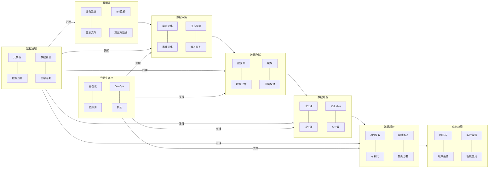
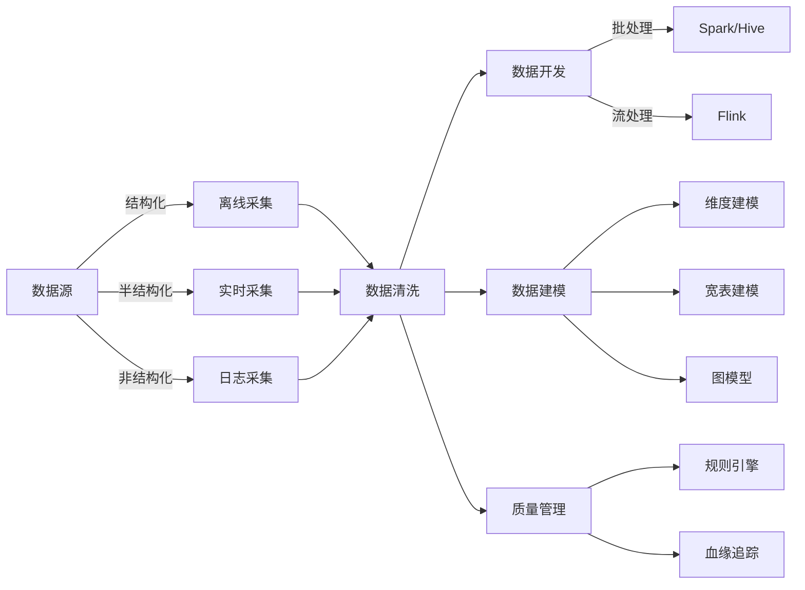
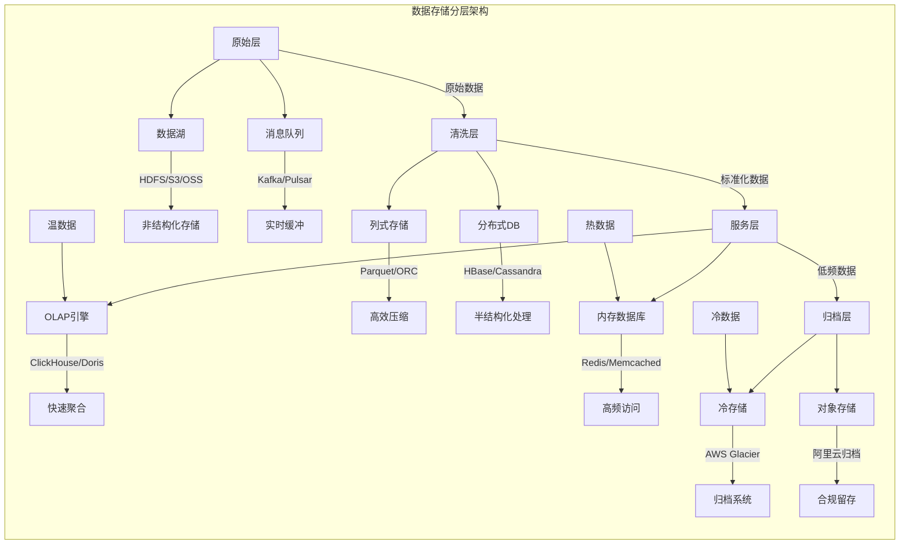
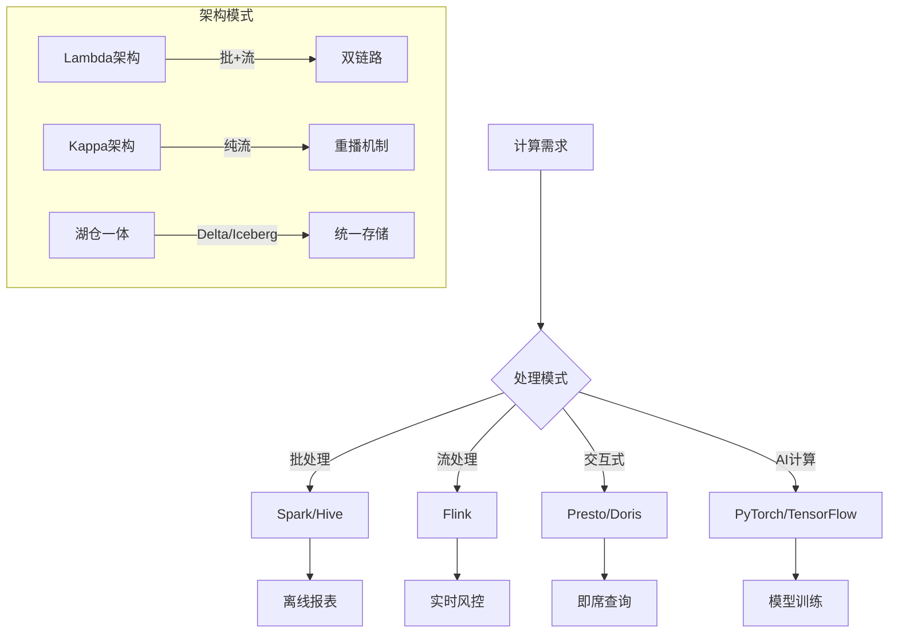
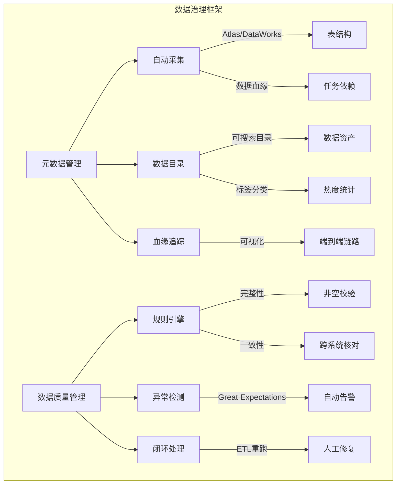
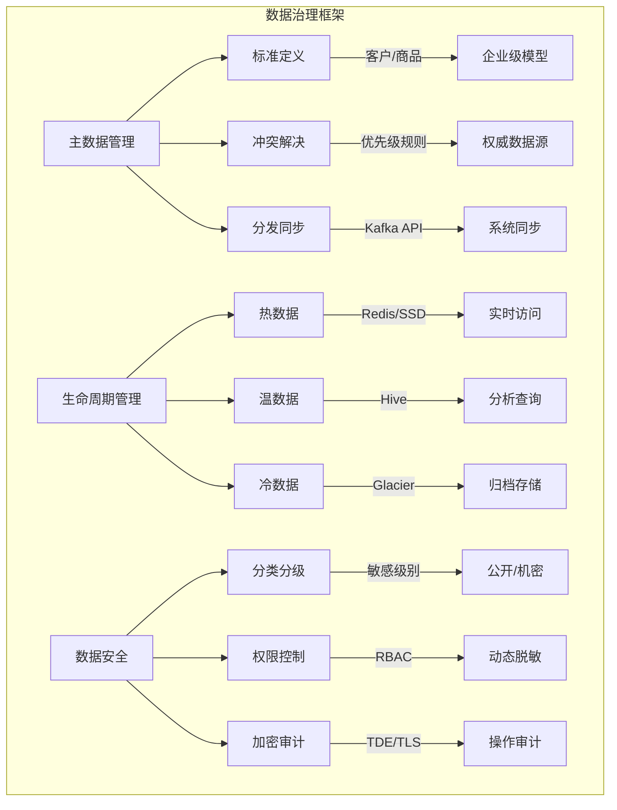
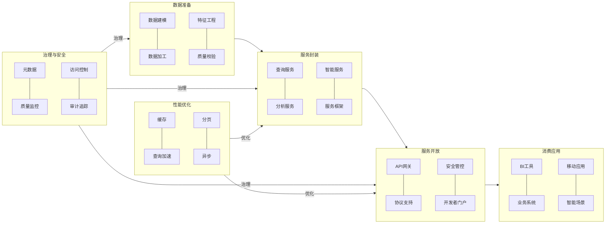

## 第一部分 数据中台基础

#### 数据中台的核心能力

###### 数据汇聚与整合能力

- **多源数据采集**：支持结构化数据（数据库、数据仓库）、半结构化数据（日志、JSON）、非结构化数据的实时/离线采集。
- **数据整合与存储**：建立统一的数据存储层，支持数据湖（存储原始数据）与数据仓库（结构化数据）的融合架构。
- **数据同步与一致性保障**：通过CDC（变更数据捕获）、双写机制等技术确保多系统间数据一致性。

###### 数据治理与资产化能力

- **元数据管理**：建立数据目录，记录数据的业务含义、来源、格式、血缘关系等元信息。
- **数据质量管理**：定义数据质量规则（完整性、准确性、一致性），自动监控并修复脏数据。
- **数据标准化与标签化**：统一数据定义（如用户ID、商品编码），构建标签体系（如用户画像标签）。
- **数据安全与合规**：通过脱敏、加密、权限控制（RBAC）保障数据隐私，满足GDPR等法规要求。

###### 数据服务化与开放能力

- **统一数据服务接口**：提供RESTful API、GraphQL、SQL查询接口，支持灵活调用。
- **数据可视化与自助分析**：通过BI工具（如Tableau、QuickBI）让业务人员自主生成报表与看板。
- **数据订阅与推送**：支持实时数据流（如Kafka Topic）的订阅，赋能实时业务场景（如风控告警）。
- **数据沙箱与实验环境**：提供安全隔离的数据实验环境，支持业务团队快速验证数据应用场景。

###### 数据智能化能力

- **机器学习平台集成**：提供从数据预处理、模型训练到在线推理的全流程支持。
- **智能分析引擎**：基于SQL的增强分析（如自动生成可视化建议）、自然语言查询（如“上月销售额最高的品类”）。
- **场景化AI应用**：
  - 用户画像与推荐系统：基于协同过滤、深度学习算法实现个性化推荐。
  - 预测性分析：如销量预测、设备故障预警。
  - 自动化决策：如金融领域的实时反欺诈、物流路径优化。

## 第二部分 数据中台架构与技术体系

#### 数据中台整体架构设计

###### 数据中台分层架构

- **数据采集层**

  - **数据源类型**：业务系统（ERP、CRM）、日志、IoT设备、第三方API等。

  - **采集方式**：

    > **实时采集**：Kafka、Flink CDC（变更数据捕获）。
    >
    > **离线采集**：Sqoop、DataX（批量同步数据库）。
    >
    > **日志采集**：Flume、Filebeat。

  - **数据缓冲与预处理**：使用消息队列（如Kafka）作为缓冲区，应对数据流量峰值。

- **数据存储层**

  - **数据湖（Data Lake）**：存储原始数据（结构化、半结构化、非结构化），支持低成本、高扩展性（HDFS、阿里云OSS）。

  - **数据仓库（Data Warehouse）**：存储清洗后的结构化数据，面向主题建模（Hive、ClickHouse、Snowflake）。

  - **融合架构（LakeHouse）**：结合数据湖与数据仓库优势（湖仓一体），如Delta Lake、Apache Iceberg。

  - **分层存储策略**：

    > 热数据（高频访问）：存入分布式数据库（如HBase、Cassandra）。
    >
    > 温数据（低频访问）：存入数据仓库。
    >
    > 冷数据（归档）：存入对象存储（如AWS Glacier）。

- **数据计算层**
  - **批处理引擎**：处理离线任务（T+1报表、ETL清洗），如Apache Spark、Hive。
  - **流处理引擎**：实时处理数据流（如风控、实时监控），如Apache Flink、Kafka Streams。
  - **交互式分析引擎**：支持快速查询（OLAP），如Presto、Doris。
  - **AI/ML计算平台**：集成机器学习框架（TensorFlow、PyTorch），提供从特征工程到模型部署的全流程支持。
  - **统一计算调度**：使用Airflow、DolphinScheduler管理任务依赖与资源分配。

- **数据服务层**
  - **统一数据服务接口**：RESTful API、GraphQL、SQL查询接口、API网关（Kong、Apigee）。
  - **数据可视化与自助分析**：集成BI工具（Tableau、Superset），支持业务人员自主分析。
  - **数据订阅与推送**：基于消息队列（Kafka）实现实时数据推送。
  - **数据沙箱**：提供安全隔离的测试环境，支持数据探索与实验。
  - **服务治理**：服务限流、熔断、监控（如Prometheus + Grafana）。

- **数据治理与安全层**
  - **元数据管理**：记录数据血缘、业务含义、技术属性（Apache Atlas、Alibaba DataWorks）。
  - **数据质量管理**：定义规则（唯一性、完整性）并自动检测异常（Great Expectations、Talend）。
  - **数据安全**：数据脱敏（如姓名、手机号）、加密（AES）、权限控制（RBAC）；合规性：满足GDPR、CCPA等法规。
  - **生命周期管理**：自动化冷热数据分级、归档与删除策略。
- **云原生数据中台**
  - **基础设施层**：云平台（AWS/Azure/阿里云）提供IaaS资源（ECS、容器服务K8s）。
  - **数据存储层**：数据湖（S3）+ 数据仓库（Redshift）+ 实时数据库（Redis）。
  - **计算引擎层**：Spark（批处理）、Flink（流处理）、SageMaker（AI）。
  - **服务层**：API网关 + 微服务（Spring Cloud）提供数据服务。
  - **治理与监控**：统一日志（ELK Stack）、监控（Prometheus）、权限（IAM）。

#### 数据汇聚与开发

###### 数据采集与接入

- **数据源分类**：
  - **结构化数据**：数据库（MySQL、Oracle）、数据仓库（Hive、ClickHouse）。
  - **半结构化数据**：日志（JSON、XML）、消息队列（Kafka）。
  - **非结构化数据**：文本、图片、音视频（存储于对象存储）。
- **离线批量同步**：Sqoop（数据库→HDFS）、DataX（多源异构同步），适用于T+1报表、历史数据迁移。
- **实时流式采集**：Kafka Connect、Flink CDC（实时捕获数据库变更），适用于交易流水实时监控、用户行为日志采集。
- **日志采集**：Filebeat（轻量级日志收集）、Flume（分布式日志聚合）。

###### 数据清洗与标准化

- **数据解析**：将非结构化数据（如日志）解析为结构化字段，工具：JSONPath、Avro Schema。
- **数据去重**：根据业务主键（如订单ID）删除重复记录，如Spark的`dropDuplicates()`、Hive窗口函数。
- **字段标准化**：统一时间格式（如UTC时间戳）、单位（如金额统一为美元）。
- **空值处理**：填充默认值（如0）、剔除无效记录、基于算法预测缺失值。
- **数据验证**：校验数据范围（如年龄>0）、枚举值（如性别仅允许“男/女”），如Great Expectations、Debezium（实时校验）。

###### 数据开发与建模

- **批处理开发**：离线报表、用户画像更新，工具：Spark SQL、Hive、Airflow（任务调度）。
- **实时处理开发**：实时风控、动态定价，工具：Flink SQL、Kafka Streams。
- **维度建模**：事实表（如交易记录） + 维度表（如用户、商品），适用于BI分析、OLAP查询。
- **宽表建模**：将多表关联结果预计算为宽表，减少查询复杂度，适用于用户行为分析（融合点击、购买、浏览数据）。
- **图模型**：构建实体关系网络（如社交网络、反欺诈图谱），如Neo4j、TigerGraph。

###### 数据质量管理与监控

- **质量规则定义**：
  - **完整性**：关键字段非空（如用户ID）。
  - **一致性**：跨系统数据匹配（如财务系统与订单系统的金额一致）。
  - **及时性**：数据按时到达（如T+1任务延迟告警）。
- **质量监控与告警**：检测异常 → 通知负责人 → 触发重跑或人工修复，利用Prometheus进行实时指标监控。
- **数据血缘追踪**：记录数据从源头到应用的完整链路，便于故障排查与影响分析（Apache Atlas、Alibaba DataWorks）。

#### 数据存储与计算

###### 存储分层与架构

- **原始层（Raw Layer）**：

  - **存储内容**：未经处理的原始数据（日志、数据库Binlog、IoT设备数据）。
  - **数据湖**：HDFS、AWS S3、阿里云OSS（支持海量非结构化数据）。
  - **分布式文件系统**：如Ceph（企业私有云场景）。
  - **特点**：低成本、高吞吐写入，适合长期存储原始数据。

- **清洗层（Cleaned Layer）**：

  - **存储内容**：经过标准化、去重、空值处理后的数据。
  - **列式存储**：Parquet、ORC（压缩率高，适合分析场景）。
  - **分布式数据库**：HBase（半结构化数据）、Cassandra（高可用写入）。
  - **特点**：数据格式统一，支持高效查询。

- **服务层（Serving Layer）**：

  - **存储内容**：面向业务的高频访问数据（如用户画像、实时统计结果）。
  - **OLAP数据库**：ClickHouse、Doris（支持快速聚合查询）。
  - **内存数据库**：Redis、Memcached（缓存热数据）。
  - **特点**：低延迟响应，直接对接业务应用。

- **归档层（Archived Layer）**：

  - **存储内容**：低频访问的历史数据（如合规要求的日志存档）。
  - **对象存储冷存储**：AWS Glacier、阿里云归档存储。
  - **特点**：成本极低，但读取延迟高（需解冻）。

- **冷热分离**：

  - **热数据（高频访问）**：存入分布式数据库（如HBase、Redis）。

  - **冷数据（归档）**：压缩后存入对象存储（如AWS Glacier）。

###### 存储技术选型对比

| **场景**             | **技术方案**         | **优势**              | **局限**              |
| :------------------- | :------------------- | :-------------------- | :-------------------- |
| **海量原始数据存储** | HDFS/S3              | 高扩展性、低成本      | 随机读写性能差        |
| **实时数据写入**     | Kafka、Apache Pulsar | 高吞吐、低延迟        | 需配合下游存储使用    |
| **结构化数据分析**   | Hive、Snowflake      | SQL兼容、支持复杂查询 | 实时性不足            |
| **实时查询与缓存**   | Redis、ClickHouse    | 亚秒级响应、高并发    | 数据量受内存/资源限制 |

###### 计算引擎分类与选型

- **批处理引擎**：
  - **场景**：离线ETL、T+1报表、历史数据清洗。
  - **Apache Spark**：内存计算优化，适合复杂数据处理。
  - **Hive**：基于MapReduce，适合稳定的大规模离线任务。
- **流处理引擎**：
  - **场景**：实时监控、风控、动态定价。
  - **Apache Flink**：低延迟、Exactly-Once语义，支持复杂事件处理（CEP）。
  - **Kafka Streams**：轻量级，与Kafka深度集成。
- **交互式分析引擎**：
  - **场景**：即席查询（Ad-hoc）、BI工具对接。
  - **Presto**：多数据源联邦查询，秒级响应。
  - **Apache Druid**：面向时序数据的OLAP优化。
- **AI计算引擎**：
  - **场景**：机器学习模型训练、推理。
  - **TensorFlow/PyTorch**：深度学习框架。
  - **Spark MLlib**：分布式机器学习库。

###### 计算架构模式

- **Lambda架构**：
  - **设计**：批处理层（离线准确结果） + 速度层（实时近似结果） → 服务层合并输出。
  - **优缺点**：兼顾准确性与实时性；但维护两套逻辑，复杂度高。
- **Kappa架构**：
  - **设计**：仅通过流处理引擎（如Flink）处理历史与实时数据，依赖重播机制。
  - **优缺点**：简化架构，逻辑统一；但依赖消息队列的长期存储能力（如Kafka保留策略）。
- **湖仓一体（Lakehouse）**：
  - **设计**：融合数据湖（灵活存储）与数据仓库（高效分析），如Delta Lake、Apache Iceberg。
  - **优点**：支持ACID事务、Schema演进，直接基于数据湖执行分析。

#### 数据治理

###### 元数据管理（Metadata Management）

- **元数据采集**：自动采集数据库表结构、字段定义、ETL任务血缘等（Apache Atlas、Alibaba DataWorks）。
- **数据目录（Data Catalog）**：提供搜索界面，业务人员可快速定位数据资产、标签化分类、数据热度统计、用户评分。
- **数据血缘（Data Lineage）**：可视化展示数据从源头到应用的完整链路（如“用户表→ETL任务→报表”）。

###### 数据质量管理（Data Quality Management）

- **规则定义**：
  - **完整性**：关键字段非空（如订单ID）。
  - **准确性**：数值范围校验（如年龄>0）。
  - **一致性**：跨系统数据匹配（如财务系统与订单系统的总金额一致）。
  - **及时性**：数据按时到达（如T+1任务延迟告警）。
- **质量监控**：定时任务扫描数据，触发告警，Great Expectations（定义规则并生成报告）、Debezium（实时数据校验）。
- **闭环处理**：通过SQL脚本或ETL任务修正数据。

###### 主数据管理（Master Data Management, MDM）

- **主数据定义**：制定企业级标准（如“客户”需包含ID、姓名、手机号、注册时间）。
- **主数据分发**：通过API或消息队列（Kafka）将主数据同步至各业务系统。
- **冲突解决**：定义优先级规则（如CRM系统为“客户”信息的权威来源）。

###### 数据生命周期管理

- **热数据**：高频访问，存于高性能存储（如Redis、SSD）。
- **温数据**：低频访问，存于数据仓库（如Hive）。
- **冷数据**：归档至低成本存储（如AWS Glacier），满足法规保留期限后自动删除。

#### 数据安全

###### 数据分类与分级

- **分类**：按业务属性划分（如用户数据、交易数据、日志数据）。
- **分级**：按敏感程度分级（如公开、内部、机密），制定差异化的保护策略。

###### 权限控制（Access Control）

- **基于角色的访问控制（RBAC）**：定义角色（如数据分析师、风控员）并分配最小必要权限（Apache Ranger、AWS IAM）。
- **动态脱敏**：根据用户角色返回部分数据（如客服仅能看到用户手机号后四位）（ProxySQL、数据脱敏中间件）。

###### 数据加密

- **静态加密（At Rest）**：数据库加密（如MySQL TDE）、文件系统加密（如HDFS Transparent Encryption）。
- **传输加密（In Transit）**：使用TLS/SSL协议保护数据传输（如Kafka SSL加密）。

###### 审计与监控

- **操作审计**：记录数据访问、修改、删除日志，留存至少6个月（满足合规要求），ELK Stack（日志分析）、AWS CloudTrail。
- **异常检测**：通过机器学习模型识别异常访问模式（如非工作时间批量导出数据）。

#### 数据服务化与API开放

###### 数据服务化的分层架构

- **数据准备层**：

  - **数据建模**：根据业务需求设计宽表、聚合表或特征表（如用户画像表）。
  - **数据加工**：通过ETL/ELT生成可复用的数据资产（如每日销售额统计表）。
  - **技术选型**：Spark、Flink、Hive。

- **服务封装层**：

  - **服务抽象**：将数据封装为业务语义明确的接口（如“获取用户最近订单”）。

  - **服务类型**：

    > **查询类**：SQL查询、键值查询（如根据用户ID获取画像）。
    >
    > **分析类**：聚合统计（如分地区销售额排名）。
    >
    > **智能类**：模型预测（如用户流失概率评分）。

  - **技术选型**：Spring Boot（微服务）、GraphQL（灵活查询）。

- **服务开放层**：

  - **API网关**：统一入口管理API的认证、限流、监控。
  - **协议支持**：RESTful API（80%场景）、WebSocket（实时推送）、gRPC（高性能通信）。
  - **技术选型**：Kong、Apigee、阿里云API网关。

###### API设计原则

- **标准化**：遵循OpenAPI规范（Swagger），提供清晰的接口文档。
- **安全性**：支持OAuth 2.0、JWT令牌认证，敏感数据脱敏（如手机号部分隐藏）。
- **性能优化**：
  - **缓存策略**：Redis缓存高频查询结果，降低数据库压力。
  - **分页与限流**：避免大结果集拖垮系统（如每页最多100条，QPS限制1000次/秒）。

###### API生命周期管理

- **开发与测试**：
  - **Mock服务**：使用Postman或Swagger UI模拟接口，供前端并行开发。
  - **自动化测试**：通过JMeter或Python脚本验证接口性能与正确性。
- **部署与版本控制**：
  - **蓝绿发布**：新版本API上线时保留旧版本，逐步切换流量。
  - **版本标识**：URL路径（如`/v1/user`）或请求头（如`Accept-Version: 2.0`）。
- **监控与运维**：
  - **指标监控**：实时跟踪API调用量、延迟、错误率（Prometheus + Grafana）。
  - **日志分析**：记录请求详情，便于排查问题（ELK Stack）。

###### 典型API类型与场景

| **API类型**     | **场景**            | **技术实现**              |
| :-------------- | :------------------ | :------------------------ |
| **查询API**     | 根据ID查询用户信息  | Redis缓存 + MySQL分库分表 |
| **分析API**     | 统计近7天活跃用户数 | Presto查询Hive宽表        |
| **实时推送API** | 交易风险告警通知    | WebSocket + Kafka消息队列 |
| **预测API**     | 用户信用评分        | Flask部署TensorFlow模型   |

#### 数据中台架构图

###### 数据中台整体架构总览图

######  数据汇聚与开发架构

###### 数据存储分层架构

###### 计算引擎架构

###### 数据治理框架

###### 数据服务化架构

