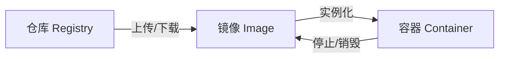
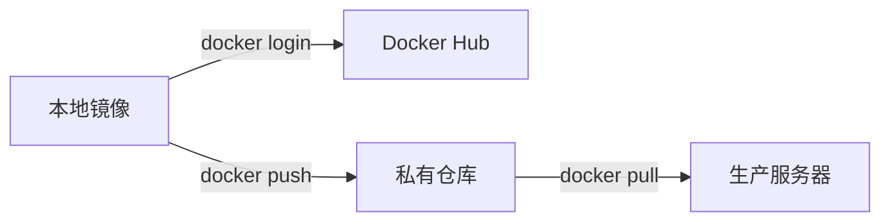
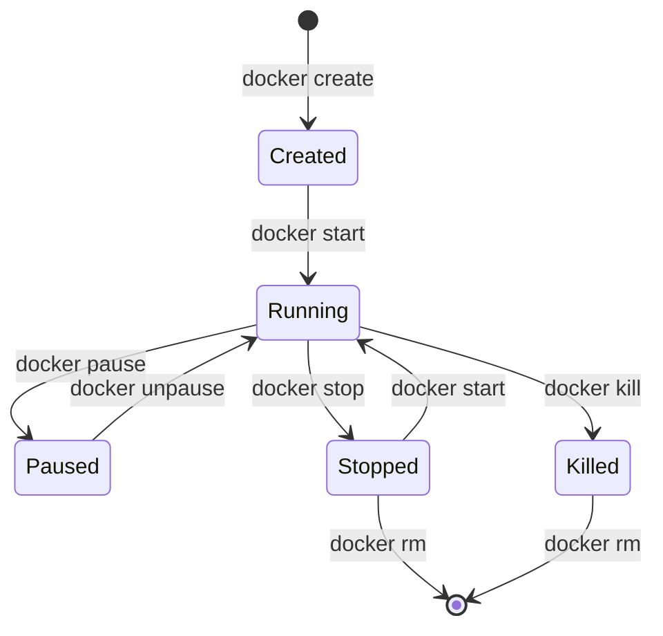
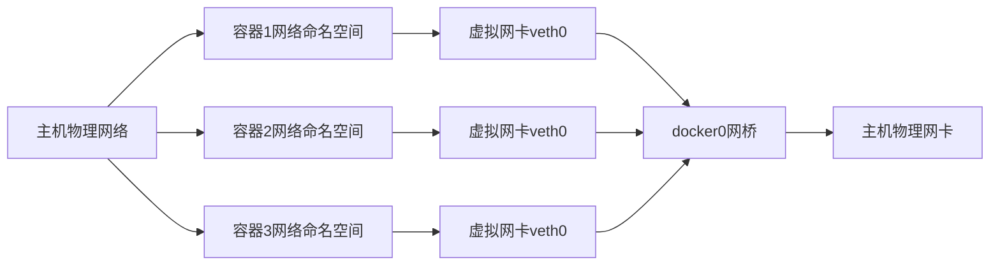

## 第一部分 Docker基础

#### 容器与Docker简介

###### 镜像（Image）

- **定义**：**静态的只读模板**，包含运行应用所需的所有依赖（代码、环境、库、配置）。
- **本质**：分层存储结构（UnionFS），每一层是文件系统的增量修改。
- **核心操作**：docker pull（拉取）、docker build（构建）、docker push（推送）。
- **生命周期**：持久化存储，可重复使用。删除需显式执行 `docker rmi`。

###### 容器（Container）

- **定义**：**镜像的运行实例**，本质是隔离的进程（通过 Linux Namespace 和 Cgroups 实现）。
- **本质**：镜像层（只读） + 容器层（读写），运行时添加数据。
- **核心操作**：docker run（创建并启动）、docker start/stop（启停）、docker exec（进入）。
- **生命周期**：临时性存在，停止后容器层数据默认丢失（需挂载卷持久化）。

###### 仓库（Registry）

- **定义**：**集中存储和分发镜像的平台**，类似代码仓库（GitHub）。
- **核心操作**：docker push（上传镜像）、docker pull（下载镜像）。



###### Docker底层技术

- **Namespace（命名空间）** → **隔离**：为进程提供独立的系统视图（PID、网络、文件系统等）。
- **Cgroups（控制组）** → **资源限制**：限制进程使用的CPU、内存、磁盘I/O资源。
- **UnionFS（联合文件系统）** → **镜像分层**：镜像由多层只读文件叠加而成，提升存储效率。

## 第二部分 核心概念与操作

#### 镜像管理

###### 镜像的本质：分层存储（UnionFS）

- **只读层（RO Layers）**：每层都是文件系统的增量修改（如安装软件、添加文件）。
- **容器层（RW Layer）**：容器启动时在镜像层之上添加**可写层**（所有修改在此层发生）。
- **关键特性**
  - **写时复制（Copy-on-Write）**：修改文件时，从下层复制到容器层再修改（原始镜像不变）。
  - **内容寻址存储**：每层通过 **SHA256哈希** 唯一标识。
  - **共享基础层**：多个镜像可共享相同基础层（如 Ubuntu 层），节省磁盘空间。

###### 镜像管理核心操作


- **docker pull [镜像名]:[标签]**：从仓库拉取镜像。
- **docker images**：列出本地镜像。
- **docker rmi [镜像ID]**：删除本地镜像。
- **docker build -t [镜像名] [路径]**：构建镜像（需 Dockerfile）。
- **docker tag [旧名] [新名]**：重命名镜像。
- **docker save -o [文件] [镜像名]**：导出镜像为 tar 文件。
- **docker load -i [文件]**：导入 tar 文件为镜像。

###### Dockerfile构建流程解析

```dockerfile
# 基础层 (可被其他镜像共享)
FROM python:3.9-slim AS builder
# 中间层 (安装依赖)
RUN pip install --no-cache-dir flask gunicorn
# 应用层 (添加代码)
COPY app.py /app/
WORKDIR /app
# 启动命令 (容器启动时执行)
CMD ["gunicorn", "-b 0.0.0.0:8000", "app:app"]
```

###### 镜像优化策略

- **多阶段构建**：丢弃构建依赖，仅保留运行时文件。
- **合并RUN命令**：减少层数，清理缓存。
- **镜像仓库管理**



#### 容器操作

###### 容器生命周期



- **Created**：容器已创建但未启动（`docker create`）。
- **Running**：运行中（`docker start/run`）。
- **Paused**：进程暂停（冻结状态，保留内存）。
- **Stopped**：进程终止（发送 SIGTERM 信号）。
- **Killed**：强制终止（发送 SIGKILL 信号）。
- **Removed**：容器被删除。

###### 核心命令操作

- **容器创建与启动**

  - **docker run**：创建并启动容器。

  - **docker create**：仅创建不启动。

  - **docker start**：启动已停止容器。

- **容器交互与管理**

  - **docker exec**：在运行中容器执行命令。

  - **docker attach**：附加到运行中容器。
  - **docker logs**：查看容器日志。
  - **docker stats**：实时监控资源。

  ```mermaid
  graph LR
      A[终端] -->|发送信号| B[Docker守护进程]
      B -->|转发信号| C[容器主进程]
      C -->|输出流| B
      B -->|显示输出| A
  ```

- **容器停止与删除**

  - **docker stop**：正常停止。
  - **docker kill**：强制停止。
  - **docker rm**：删除容器。

  ```mermaid
  graph LR
      A[docker stop] --> B[发送SIGTERM]
      B --> C{10秒内退出?}
      C -->|是| D[正常退出]
      C -->|否| E[发送SIGKILL]
      
      F[docker kill] --> G[直接发送SIGKILL]
  ```

#### 数据持久化与卷（Volumes）

###### Docker数据持久化

- **卷（Volumes）**：Docker 管理的存储区域，独立于容器生命周期；支持加密、权限控制；高性能（本地/云存储驱动）。

- **绑定挂载（Bind Mounts）**：直接映射主机任意目录，容器可修改主机文件系统，适合开发环境代码同步。

- **临时文件系统（tmpfs）**：数据仅存储在内存中，容器停止即消失，适合敏感临时数据。

###### 卷（Volumes）


- **docker volume create <name>**：创建命名卷。
- **docker volume ls**：列出所有卷。
- **docker volume inspect <name>**：查看卷详细信息。
- **docker run -v <volume>:<path>**：挂载卷到容器。

###### 持久化核心要点


#### 网络配置

###### Docker 网络架构



- **网络命名空间(Network Namespace)**：每个容器独立的网络栈。
- **虚拟网卡对(veth pair)**：连接容器和网桥。
- **网桥(Bridge)**：软件交换机（默认docker0）。
- **IPtables/NAT**：实现端口映射和防火墙。

###### Docker 网络驱动类型

| **模式**    | **命令参数**        | **特点**          | **适用场景**   |
| :---------- | :------------------ | :---------------- | :------------- |
| **Bridge**  | `--network=bridge`  | 默认模式，NAT隔离 | 单主机容器通信 |
| **Host**    | `--network=host`    | 共享主机网络栈    | 高性能需求     |
| **Overlay** | `--network=overlay` | 多主机容器网络    | Swarm/K8s集群  |
| **Macvlan** | `--network=macvlan` | 直接分配MAC地址   | 传统网络集成   |
| **None**    | `--network=none`    | 无网络            | 安全敏感场景   |

## 第三部分 进阶应用

#### Dockerfile与镜像构建


#### Docker Compose


#### Docker Swarm（集群管理）


## 第四部分 生产实践与生态

#### 监控与日志管理


#### 持续集成/持续部署（CI/CD）


#### Kubernetes与Docker


#### 云原生与微服务架构