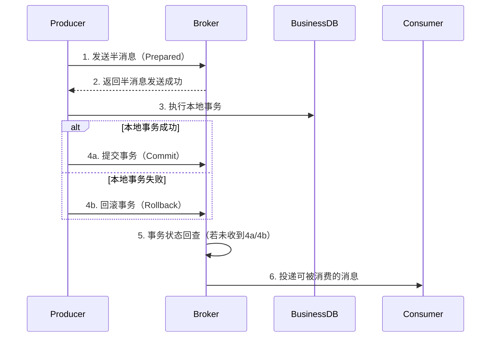

## 第一部分 MQ基础

#### 消息中间件概述

###### 消息中间件的定义与作用

- **核心概念**：一种基于**异步消息传递**的中间件（Message-Oriented Middleware, MOM），用于协调分布式系统中不同组件的通信。
- **核心功能**：提供消息的**传输、存储、路由与投递**，确保生产者（Producer）与消费者（Consumer）解耦。
- **类比模型**：类似“快递系统”，生产者发送消息（寄件），中间件存储与分发（物流），消费者接收消息（收件）。
- **MQ作用**：解耦系统依赖、异步处理提升响应速度、流量削峰填谷、冗余存储与持久化、扩展性与负载均衡、顺序性与事务支持。

###### 消息中间件核心组件

- **生产者（Producer）**：创建并发送消息到中间件。
- **消费者（Consumer）**：订阅并消费消息。
- **Broker**：中间件的核心服务节点，负责存储、路由与投递。
- **主题（Topic）/队列（Queue）**：逻辑消息分类单位（如 Kafka Topic、RabbitMQ Queue）。
- **路由机制**：决定消息分发规则（如 RabbitMQ Exchange 绑定策略）。

###### 消息中间件的核心特性

- **解耦**：系统间直接依赖导致紧耦合（如服务宕机引发级联故障），引入中间件作为“缓冲层”，生产者与消费者无需感知彼此。
- **异步**：同步调用阻塞主流程（如用户注册后需同步发送邮件），引入中间件将非核心操作异步化，主流程快速返回结果。
- **削峰**：突发流量会压垮后端服务（如秒杀活动），采用队列缓冲流量，后端按能力消费。

###### 主流消息中间件对比（Kafka、RabbitMQ、RocketMQ、ActiveMQ

- **Kafka**

  - **高吞吐**：分布式分区设计，支持百万级TPS。
  - **持久化**：消息持久化存储，支持回溯与批量消费。
  - **流处理**：与Kafka Streams、Flink深度集成。
  - **适用场景**：大数据实时管道（日志收集、指标监控）、流式计算与事件溯源、高吞吐量场景（如广告点击流）。

- **RabbitMQ**

  - **灵活路由**：支持多种Exchange类型（直连、主题、扇出等）。
  - **协议丰富**：兼容AMQP、MQTT、STOMP等协议。
  - **低延迟**：内存队列优先，实时性高。
  - **适用场景**：企业级应用（订单通知、任务分发）、复杂路由需求（如多消费者广播）、低延迟实时通信（如IM消息推送）。

- **RocketMQ**

  - **事务消息**：支持分布式事务（2PC）。
  - **顺序消息**：分区内严格顺序消费。
  - **低延迟**：阿里优化，适合电商场景。
  - **适用场景**：电商交易（订单创建、支付回调）、金融级事务消息（如跨系统转账）、高可靠顺序消息（如库存扣减）。

- **横向对比**

  | **维度**     | **Kafka**          | **RabbitMQ**     | **RocketMQ**       |
  | :----------- | :----------------- | :--------------- | :----------------- |
  | **吞吐量**   | 超高（百万级TPS）  | 中（万级TPS）    | 高（十万级TPS）    |
  | **延迟**     | 较高（批处理优化） | 低（毫秒级）     | 低（毫秒级）       |
  | **可靠性**   | 高（多副本同步）   | 高（镜像队列）   | 高（主从同步）     |
  | **功能特性** | 流处理、持久化     | 灵活路由、多协议 | 事务消息、顺序消息 |
  | **适用场景** | 大数据、流式计算   | 企业级异步通信   | 电商、金融事务     |

###### 消息中间件的技术选型建议

- **场景驱动**：大数据流处理 → Kafka；分布式事务 → RocketMQ复杂路由 → RabbitMQ。
- **性能与扩展性**：高吞吐选Kafka，低延迟选RabbitMQ/RocketMQ。
- **运维成本**：Kafka配置复杂但生态强，RocketMQ适合阿里云环境，RabbitMQ社区资源丰富。
- **协议兼容性**：需支持MQTT/IoT设备 → RabbitMQ；需兼容JMS → ActiveMQ/RocketMQ。

#### 消息中间件基础

###### 消息模型

- **点对点模型（Point-to-Point, P2P）**

  - **一对一通信**：每条消息仅被一个消费者处理。

  - **队列机制**：消息存储在队列（Queue）中，多个消费者可监听同一队列，但每条消息仅被一个消费者消费。

  - **负载均衡**：通过竞争消费模式（多个消费者共享队列）实现横向扩展。

  - **工作流程**：生产者发送消息到指定队列；消费者监听队列，按优先级拉取消息；消息被消费后标记已处理，确保不重复消费。

- **发布-订阅模型（Publish-Subscribe, Pub/Sub）**

  - **一对多通信**：一条消息被广播到所有订阅者。
  - **主题机制**：消息通过主题（Topic）或交换机（Exchange）路由到多个队列。
  - **动态订阅**：消费者可随时订阅或取消订阅主题。
  - **工作流程**：生产者发送消息到**Topic**或交换机；中间件根据规则将消息复制到多个队列；消费者订阅队列，独立消费消息。

- **消息模型对比**

  | **维度**         | **点对点模型**         | **发布-订阅模型**                   |
  | :--------------- | :--------------------- | :---------------------------------- |
  | **消息消费模式** | 一对一（单消费者）     | 一对多（多消费者）                  |
  | **典型组件**     | 队列（Queue）          | 主题（Topic）/交换机（Exchange）    |
  | **顺序性**       | 队列内严格有序         | 主题分区内有序，全局无序（如Kafka） |
  | **扩展性**       | 通过消费者负载均衡扩展 | 通过多订阅者独立消费扩展            |
  | **适用场景**     | 任务分发、异步处理     | 事件广播、实时通知                  |

###### 消息协议

- **AMQP（Advanced Message Queuing Protocol）**

  - **协议定位**：面向企业级的开放标准协议，支持复杂消息路由和可靠传输。
  - **设计目标**：提供跨平台、高可靠的消息传递，支持事务、持久化、灵活路由。
  - **消息模型**：点对点（Queue）、发布-订阅（Exchange + Binding）。
  - **核心组件**：**Exchange**路由消息到队列；**Queue**存储消息，供消费者拉取；**Binding**定义Exchange与Queue的映射关系。

- **MQTT（Message Queuing Telemetry Transport）**

  - **协议定位**：轻量级、低功耗的发布-订阅协议，专为物联网设计。

  - **服务质量（QoS）**：

    > **QoS 0**（至多一次）：不保证送达，适用于非关键数据（如传感器温度上报）。
    >
    > **QoS 1**（至少一次）：确保送达，但可能重复（如设备状态更新）。
    >
    > **QoS 2**（精确一次）：严格保证仅一次传输（如关键指令下发）。

- **STOMP（Simple Text Oriented Messaging Protocol）**：基于文本的简单协议，类似HTTP，易于调试和实现。

- **OpenMessaging（开放消息标准）**：跨厂商的开放标准，统一消息中间件API和语义。

###### 消息的可靠性传输

- **持久化**：将消息存储到**非易失性介质**（如磁盘），防止因系统崩溃或重启导致消息丢失。
  - **队列持久化**：队列元数据与消息均落盘（如RabbitMQ的`durable=true`）。
  - **消息日志存储**：消息以追加写入日志文件方式保存（如Kafka的Partition分段存储）。
- **确认机制**
  - **生产者确认**：生产者发送消息后，等待Broker确认（如RabbitMQ的`confirm`模式，Kafka的`acks=all`）。
  - **消费者确认**：消费者处理消息后，向Broker发送ACK，Broker才删除消息（RabbitMQ）或提交偏移量（Kafka）。
  - **失败处理**：若未ACK或处理失败，Broker重新投递消息（RabbitMQ）或保留未提交偏移量（Kafka）。

###### 消息的顺序性与重复性问题

- **顺序性问题根源**
  - **并发消费**：多个消费者或线程并行处理消息，导致乱序。
  - **分区/队列分发**：消息被分发到不同分区或队列（如Kafka Partition），无法全局有序。
- **顺序性问题解法**
  - **单分区顺序性**：同一业务键（如订单ID）的消息固定发送到同一分区/队列（Kafka通过`key`路由）。
  - **单消费者串行处理**：同一队列仅允许单线程消费（牺牲并发性）。
  - **顺序标记**：消费者按消息序号处理，跳过乱序消息（需依赖中间件支持）。
- **重复性问题根源**
  - **生产者重试**：网络抖动导致生产者重复发送消息。
  - **消费者ACK失败**：消费者处理成功但未提交确认，消息被重新投递（如Kafka偏移量未提交）。
- **重复性问题解法**
  - **幂等性设计**：业务逻辑天然支持重复处理（如数据库唯一索引、状态机）。
  - **去重表**：记录已处理消息的唯一ID（如消息ID、业务主键）。
  - **中间件去重**：Kafka的`enable.idempotence=true`（生产者幂等），RocketMQ的`Message ID`去重。

###### 消息的事务支持

- **核心目标**：确保**消息发送与业务操作**的原子性，避免数据不一致和消息无效。

- **两阶段提交（2PC）**
  - **准备阶段**：消息中间件暂存消息（半消息/预消息），不对外可见。
  - **提交/回滚阶段**：业务操作完成后，确认提交或回滚消息。

- **本地消息表（最终一致性）**：业务操作与消息写入**本地数据库事务**；后台任务轮询本地表，重试发送未成功的消息。
- **最大努力通知**：先执行业务操作，异步发送消息；若消息发送失败，按策略重试（不保证绝对成功）。

## 第二部分 MQ进阶

#### 高并发与高可用设计

###### 消息存储机制

- **文件存储系统**
  - **顺序写入**：消息以**追加（Append-Only）**方式写入文件，避免随机磁盘寻道，最大化I/O吞吐量。
  - **分段存储**：将大文件拆分为多个固定大小的段（Segment），例如Kafka的`Partition`分段（默认1GB），便于管理和清理。
  - **零拷贝优化**：通过`sendfile`或`mmap`技术减少数据在用户态和内核态的拷贝次数，提升网络传输效率。
- **数据库存储**
  - **表结构存储**：消息存储在关系型数据库（如MySQL）或NoSQL（如MongoDB）中，通过事务保证一致性。
  - **索引优化**：为消息ID、主题、状态等字段建立索引，加速查询。
  - **批量写入**：合并多次写入操作，减少事务提交次数。
- **日志结构存储**
  - **日志追加**：消息按时间顺序追加到日志文件，类似于WAL（Write-Ahead Logging）。
  - **稀疏索引**：通过内存或磁盘索引快速定位消息（如Kafka的`offset → position`映射）。
  - **数据分片**：将日志划分为多个分片（Shard），分散存储压力（如Apache Pulsar的`Segment`）。

###### 消息分区与负载均衡

- **消息分区**

  - **定义**：将消息流按规则分散到多个独立的存储单元（分区/队列），每个分区独立处理。
  - **提升并发**：允许多个消费者并行处理不同分区的消息。
  - **数据隔离**：避免单点资源竞争（如磁盘I/O、CPU）。
  - **容错性**：单个分区故障不影响整体服务。

- **分区策略**

  - **哈希分区**：根据消息键（Key）的哈希值分配分区（如Kafka的`hash(key) % partition_num`）。
  - **轮训分区**：按顺序依次分配消息到各分区（如无Key时Kafka默认策略）。
  - **范围分区**：按键的范围划分分区（如时间范围或ID区间）。

- **负载均衡**

  - **消费者组（Consumer Group）**：

    > **Kafka**：同一消费者组内的消费者共享订阅Topic，每个分区仅由一个消费者处理。
    >
    > **RabbitMQ**：通过`Work Queue`模式，多个消费者竞争同一队列的消息。

  - **动态分配策略**：

    > **Range Assignor**（默认）：按分区范围静态分配（可能导致分配不均）。
    >
    > **RoundRobin**：轮询分配，均衡性更好。
    >
    > **StickyAssignor**：尽量保持消费者与分区的绑定关系，减少再均衡开销。

- **负载均衡实现**
  - **Kafka**：基于消费者组的Rebalance机制，通过协调器（Coordinator）动态分配分区。
  - **RabbitMQ**：通过`Channel`的预取计数（Prefetch Count）控制消费者拉取消息的速率。
  - **RocketMQ**：基于消息队列（MessageQueue）的负载均衡，消费者通过`AllocateMessageQueueStrategy`分配队列。

###### 集群部署与主从复制

- **集群部署**

  - **主从模式**：主节点处理所有写操作，并负责数据同步到从节点，从节点仅处理读操作，通过复制主节点数据保持一致性。

  - **多主模式**：多个节点均可处理写操作，数据通过冲突解决机制（如版本向量、时间戳）实现最终一致性。

  - **分片模式**：将数据按规则（如哈希、范围）拆分到不同节点，每个节点独立处理部分数据。

- **主从复制**

  - **同步复制**：主节点写入数据后，需等待所有从节点确认写入成功才返回客户端响应。

  - **异步复制**：主节点写入数据后立即返回响应，从节点异步拉取数据更新。

  - **半同步复制**：主节点写入数据后，至少等待一个从节点确认后才返回响应。

###### 故障转移与容灾设计

- **故障转移（Failover）的核心机制**

  - **主从切换**：从节点（Follower）实时复制主节点数据，主节点故障时升级为新主节点。

  - **多副本一致性保障**：主节点写入需等待所有副本确认（强一致）；主节点写入后立即响应，副本异步同步（弱一致）。
  - **脑裂（Split-Brain）问题与解决**：网络分区导致多个主节点同时写入，数据冲突。

- **容灾设计（Disaster Recovery）的核心策略**
  - **同城多活**：主备集群部署在同一城市的不同机房，延迟低；数据同步通过专线实时复制。
  - **异地多活**：数据分片部署在多个地域（如北京、上海、深圳），每个地域独立处理部分流量，数据异步同步。
- **数据备份与恢复**
  - **全量备份**：定期生成快照（如Kafka的Log Retention策略）。
  - **增量备份**：记录增量操作日志（如MySQL Binlog、RocketMQ的CommitLog）。
  - **恢复流程**：从备份介质（如HDFS、S3）恢复全量数据；重放增量日志到最新状态；验证数据一致性后接入流量。

###### 消息堆积与流量控制

- **消息堆积的常见原因**
  - **消费能力处理不足**：消费者消费速度低于生产者发送速度，导致积压。
  - **消费者故障或阻塞**：消费者宕机或处理消息时发生死锁、长时间GC等。
  - **消息处理逻辑复杂**：单条消息处理耗时过长（如调用外部API、复杂计算）。
  - **网络或存储瓶颈**：消费者与Broker之间网络延迟高，或存储层（如磁盘、数据库）成为瓶颈。

- **消息堆积的影响**
  - **系统资源耗尽**：队列占用内存或磁盘空间，导致Broker宕机。
  - **消息延迟增加**：消费者处理滞后，影响业务实时性（如订单支付状态更新）。
  - **数据丢失风险**：堆积触发消息过期删除策略（如Kafka的`retention.ms`），导致数据丢失。

- **消息堆积的核心策略**
  - **水平扩展消费者**：增加消费者实例或线程数（如Kafka通过增加Consumer Group成员）。
  - **优化消费逻辑**：减少单消息处理耗时（如异步化、批处理、缓存优化）。
  - **死信队列（DLQ）**：将多次重试失败的消息转移到独立队列，避免阻塞正常消费。
  - **动态降级**：暂时跳过非核心消息（如日志采集场景下丢弃DEBUG日志）。
  - **消息过期与清理**：配置消息TTL（Time-To-Live），自动清理过期消息（如RabbitMQ的`x-message-ttl`）。

- **生产者流量控制**
  - **限流（Rate Limiting）**：限制生产者发送速率（如每秒最多1000条）。
  - **背压（Backpressure）**：根据Broker或消费者状态动态调整发送速率（如TCP滑动窗口机制）。
  - **批量发送**：合并多条消息为单个请求发送，减少网络开销（如Kafka的`linger.ms`和`batch.size`）。

- **消费者流量控制**
  - **拉取速率控制**：限制单次拉取消息数量（如Kafka的`max.poll.records`）。
  - **处理并发度控制**：限制消费者线程数或协程数（如RabbitMQ的`prefetchCount`）。
  - **动态扩缩容**：根据队列堆积情况自动增减消费者实例（如K8s HPA）。

- **中间件级流量控制**
  - **Kafka**：生产者使用`acks`参数控制写入确认级别；消费者通过`max.poll.interval.ms`检测消费超时。
  - **RabbitMQ**：设置队列最大长度（`x-max-length`）；内存/磁盘警报触发流控。
  - **RocketMQ**：Broker读写权限控制（`writeable`/`readable`）；消费者限速（`pullThresholdForQueue`）。

- **高可用设计中的容错与弹性**

  - **自动伸缩**：垂直伸缩升级CPU、内存配置；水平伸缩Broker扩容、消费者扩容。

  - **熔断与降级**：当消费者连续失败超过阈值时，暂时跳过消息（如通过Hystrix或Sentinel）。

- **实践总结**

  | **场景**               | **推荐策略**                                          | **中间件示例**        |
  | :--------------------- | :---------------------------------------------------- | :-------------------- |
  | **突发流量堆积**       | 动态扩容消费者 + 生产者限流（如令牌桶算法）           | Kafka + K8s HPA       |
  | **消费者处理能力不足** | 优化消费逻辑（异步/批处理） + 增加`prefetchCount`     | RabbitMQ + 线程池优化 |
  | **Broker磁盘过载**     | 启用分层存储（如Kafka Tiered Storage） + 清理过期数据 | Kafka + 云存储（S3）  |
  | **跨地域流量控制**     | 就近接入 + 异步复制（如Kafka MirrorMaker）            | Kafka跨集群复制       |

#### 消息中间件核心功能实现

###### 生产者设计与消息发送流程

- **消息构造与序列化**

  - **消息结构**

    ```java
    // Kafka消息示例（键值对结构）
    public class ProducerRecord<K, V> {
        private String topic;     // 目标主题
        private K key;           // 分区路由键（可选）
        private V value;         // 消息体
        private Long timestamp;  // 时间戳
    }

  - **序列化**：将对象转为字节流（如JSON、Protobuf、Avro）。

- **消息路由（分区选择）**
  - **哈希路由**：按Key哈希值选择分区（保证相同Key的消息顺序性）。
  - **轮询路由**：依次分发到不同分区（负载均衡）。
  - **自定义路由**：根据业务逻辑实现（如按地理位置）。

- **消息发送模式**
  - **同步发送**： 发送消息后阻塞等待Broker确认，收到ACK后继续下一消息。
  - **异步发送**：发送消息后立即返回，通过回调（Callback）处理结果。
  - **批量发送**：累积多条消息合并发送，减少网络开销（需平衡`linger.ms`和`batch.size`）。

- **可靠性保障机制**

  - **ACK确认机制**：

    > **`acks=0`**：无需Broker确认（可能丢失消息）。
    >
    > **`acks=1`**：Leader副本写入即确认（平衡性能与可靠性）。
    >
    > **`acks=all`**：所有ISR副本写入后确认（强一致，高延迟）。

  - 重试机制和幂等。

- **内存管理与流量控制**
  - **缓冲池**：每个分区对应一个双端队列，缓存待发送消息。
  - **流量控制**：控制生产者缓冲区满时的最大阻塞时间与生产者总内存缓冲区大小。

- **消息发送全流程**
  - **初始化生产者**：加载配置（序列化器、分区器、ACK策略等）；建立与Broker的连接（如Kafka的`Metadata`更新）。
  - **构造消息**：填充Topic、Key、Value、Header等元数据。
  - **序列化与路由**：序列化Key/Value为字节流；根据分区策略选择目标分区。
  - **写入缓冲区**：消息按分区存入`RecordAccumulator`；后台Sender线程异步提取批次。
  - **网络发送**：Sender线程将批次封装为`ProducerRequest`；通过Selector多路复用IO发送至Broker。
  - **处理响应**：Broker返回`ProducerResponse`，触发回调或异常处理；失败时根据重试策略重新入队。

###### 消费者设计与消息拉取/推送机制

- **拉取（Pull）**：消费者主动向Broker请求消息（如HTTP轮询）。
- **推送（Push）**：Broker主动将消息发送给消费者（如TCP长连接）。
- **消息订阅与分区分配**
  - **订阅模式**：消费者订阅一个或多个Topic，或者绑定到指定队列。
  - **分区分配策略**：按分区范围分配、轮训分配、与消费者绑定。

- **消息拉取流程（Pull模式）**
  - **初始化消费者**：连接Broker，加入消费者组（如Kafka的`Consumer Group`）；获取Topic元数据（分区、Leader副本位置）。
  - **拉取消息**：发送`FetchRequest`到Broker，指定分区和偏移量；Broker返回`FetchResponse`包含消息批次。
  - **处理消息**：反序列化消息体（如JSON转对象）；执行业务逻辑（如更新数据库、调用API）。
  - **提交偏移量**：手动提交（`commitSync()`）或自动提交（`enable.auto.commit=true`）。

- **消息推送流程（Push模式）**
  - **建立长连接**：消费者与Broker建立TCP长连接（如RabbitMQ的AMQP Channel）。
  - **注册回调**：消费者声明队列并注册消息到达时的回调函数。
  - **Broker推送**：Broker将消息通过Channel推送给消费者；消费者处理完成后发送ACK确认。

- **消息确认（ACK）机制**
  - **自动ACK**：消息到达消费者即视为成功，Broker立即删除消息。
  - **手动ACK**：消费者处理完成后显式发送ACK，Broker删除消息。
  - **批量ACK**：累积多条消息后一次性确认（减少网络开销）。

###### Broker的核心职责

- **路由（Routing）**：根据规则将消息分发到目标队列/主题。
  - **Exchange路由**（RabbitMQ）：Direct/Topic/Fanout模式。
  - **分区键路由**（Kafka）：按Key哈希选择分区。
  - **标签过滤**（RocketMQ）：消息Tag匹配消费者订阅规则。
- **存储**：持久化消息，防止数据丢失。
  - **日志分段存储**（Kafka）：消息追加到Partition日志文件，定期清理过期数据。
  - **队列持久化**（RabbitMQ）：消息写入磁盘，支持内存缓存加速。
  - **多副本同步**（RocketMQ）：主从节点同步CommitLog。
- **投递**：将消息可靠传递给消费者，支持多种消费模式。
  - **推模式**（RabbitMQ）：Broker主动推送消息到消费者，通过ACK确认。
  - **拉模式**（Kafka）：消费者轮询拉取消息，管理偏移量。
  - **重试机制**：失败消息重投递（如RocketMQ的`%RETRY%`队列）。

###### 消息索引与快速检索

- **索引类型与实现**
  - **偏移量索引**：记录消息偏移量（Offset）与物理位置的映射（如Kafka的`.index`文件）。
  - **时间戳索引**：建立时间戳与Offset的映射关系（如Kafka的`.timeindex`文件）。
  - **哈希索引**：通过消息Key的哈希值直接定位分区或存储位置（如Redis Streams）。
  - **标签过滤索引**：基于消息标签（Tag）建立倒排索引（如RocketMQ的ConsumeQueue）。

- **快速检索的核心算法**

  - **二分查找：在索引文件中二分查找**小于等于目标值**的最大条目；根据条目中的物理位置，跳转到日志文件继续线性扫描。
  - **稀疏索引**：Kafka每个索引条目间隔约4KB；检索时通过稀疏索引定位大致范围，再在日志文件中微调。

  - **内存映射（mmap）加速**：将索引文件映射到内存，绕过内核态与用户态数据拷贝。

###### 死信队列与延迟消息

- **死信队列触发条件**

  - **消息被拒绝**：消费者显式拒绝消息且不重新入队。
  - **重试次数超限**：消息达到最大重试次数。
  - **消息过期（TTL）**：消息在队列中存活时间超过设定阈值。

  - **队列满**：队列达到最大容量。

- **私信队列实现机制**

  - **RabbitMQ**：声明死信交换器（DLX）和队列；为原队列设置`x-dead-letter-exchange`参数。
  - **Kafka**：将失败消息转发到指定Topic；使用拦截器或消费者重试逻辑。
  - **RocketMQ**：内置死信队列（`%DLQ%` + ConsumerGroup），自动转移多次重试失败的消息。

- **延迟消息（Delayed Message）**
  - **定时任务**：在指定时间后触发操作（如订单15分钟未支付自动关闭）。
  - **流量削峰**：将突发请求分散到不同时间段处理（如秒杀活动排队）。
  - **状态流转**：实现状态机超时控制（如工单超时自动升级处理）。

## 第三部分 MQ高级特性及原码解析

#### 典型消息中间件源码解析

###### Kafka存储层设计

- **Partition**：并行存储与消费的基本单元
  - **并行扩展**：每个Partition独立存储和读写，支持水平扩展。
  - **顺序性保证**：同一Partition内消息严格有序（Offset单调递增）。
  - **物理结构**：每个Partition对应磁盘上的一个目录，目录名为`<topic>-<partition_id>`。
  - **逻辑结构**：Partition被拆分为多个**Segment文件**（日志+索引），通过`ConcurrentSkipListMap`维护Segment序列。

- **Segment**：高效存储与检索的基石
  - **日志文件**：存储实际消息（追加写入）。
  - **偏移量索引**： 存储Offset→物理位置的映射（稀疏索引）。
  - **时间戳索引**：存储时间戳→Offset的映射。
  - **稀疏索引设计**：每写入`log.index.interval.bytes`（默认4KB）数据，添加一条索引记录。

- **ISR机制**：高可用与一致性保障
  - **ISR（In-Sync Replicas）** ：是Kafka实现高可用的核心机制，确保副本间数据一致。
  - **ISR成员**：与Leader副本保持同步的Follower副本集合（包括Leader自身）。
  - **加入条件**：Follower副本追平Leader最新数据（通过`ReplicaFetcherThread`同步）。
  - **踢出条件**：Follower落后超过`replica.lag.time.max.ms`（默认30秒）。
  - **Leader选举**：Leader副本宕机或主动下线。

###### RocketMQ事务消息实现原理

- **事务消息整体流程**



- **半消息（Prepared Message）的存储**

  - **特殊Topic**：半消息发送到内部Topic `RMQ_SYS_TRANS_HALF_TOPIC`，**对消费者不可见**。

  - **存储结构**：半消息与普通消息格式相同，但追加属性 `TRANSACTION_PREPARED=true`。

- **事务状态回查（核心容错机制）**
  - **回查触发条件**：Broker未收到 `Commit/Rollback` 指令；生产者宕机或网络中断。
  - **回查逻辑**：读取半消息队列，筛选超时消息；向生产者发起回查请求；根据回查结果提交或回滚消息。

- **事务消息的提交与投递**
  - **提交事务**：将半消息从 `RMQ_SYS_TRANS_HALF_TOPIC` 转移到原始目标Topic。
  - **回滚事务**：将半消息标记为删除（写入 `OP` 操作队列）。

- **防丢失机制**
  - **半消息持久化**：所有半消息写入CommitLog（磁盘），即使Broker宕机也不丢失。
  - **OP队列（Operation Queue）**：记录所有事务操作（提交/回滚），用于故障恢复。

- **防重复投递**
  - **消息唯一ID**：每条消息携带 `uniqId`，消费者需实现幂等。
  - **OP队列去重**：Broker在投递前检查OP队列，避免重复提交。

- **高可用设计**
  - **Broker主从同步**：半消息和OP队列通过主从复制（HA）保障高可用。
  - **回查服务冗余**：多Broker节点同时运行回查线程（通过分布式锁避免重复回查）。

###### RabbitMQ的Exchange与队列绑定机制

- **元数据管理**：绑定信息存储在Mnesia数据库（Erlang内置分布式DB），键为 `{Exchange, Queue, RoutingKey}` 三元组。

- **消息路由流程**
  - **生产者发送**：消息经`rabbit_channel`进程解析，调用。
  - **路由决策**：根据Exchange类型调用对应模块。
  - **消息投递**：匹配成功后，消息写入目标队列的存储层。

- **队列绑定与解绑**
  - **动态生效**：绑定关系变更实时更新路由表，无需重启服务。
  - **解绑影响**：解绑后，Exchange不再向该队列路由消息，但已入队消息不受影响。

#### 消息中间件高级特性

###### 顺序消息的实现方案


###### 分布式事务与最终一致性


###### 消息轨迹与监控


###### 消息中间件的扩展性设计


#### 消息中间件的未来演进

###### 云原生消息队列（如Apache Pulsar）


###### Serverless与消息中间件的结合


###### 消息队列在边缘计算中的应用

